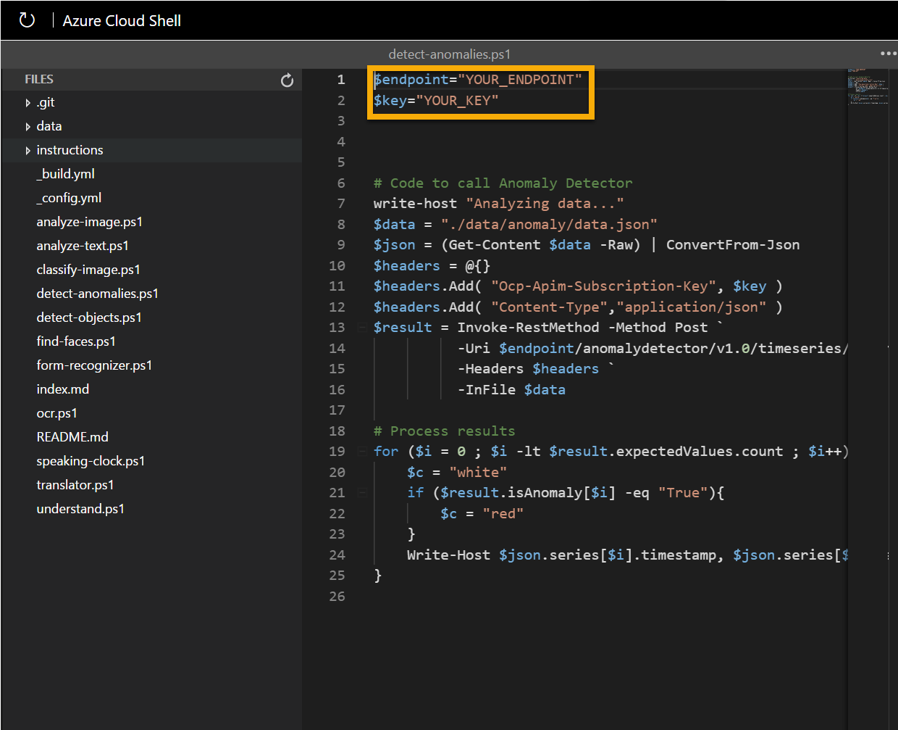

---
lab:
  title: Изучение Cognitive Services
---

# <a name="explore-cognitive-services"></a>Изучение Cognitive Services

> **Примечание**. Для выполнения этого задания вам потребуется [подписка Azure](https://azure.microsoft.com/free?azure-portal=true), в которой у вас есть административный доступ.

Azure Cognitive Services инкапсулирует общие функции ИИ, которые можно разделить на четыре основных компонента: зрение, речь, язык и службы принятия решений. В этом упражнении вы изучите одну из служб принятия решений, чтобы получить общее представление о том, как подготовить и использовать ресурс Cognitive Services в приложении.

Конкретная служба Cognivite Service, с которой вы познакомитесь в этом упражнении, — *Детектор аномалий*. Детектор аномалий используется для анализа значений данных с течением времени и для обнаружения необычных значений, которые могут указывать на проблему или на ситуацию, требующую дальнейшего изучения. Например, датчик в хранилище с контролем температуры может отслеживать температуру каждую минуту и регистрировать измеренные значения. Службу "Детектор аномалий" можно использовать для анализа зарегистрированных значений температуры и для маркировки любых значений, которые существенно отклоняются от нормального диапазона ожидаемых температур.

Чтобы протестировать возможности службы "Детектор аномалий", мы используем простое приложение командной строки, которое выполняется в Cloud Shell. Те же принципы и функциональные возможности реализованы и в реальных решениях, таких как веб-сайты и приложения для телефонов.

> **Примечание** Цель этого упражнения — получить общее представление о том, как подготавливаются и используются когнитивные службы. В качестве примера используется служба "Детектор аномалий", однако из этого упражнения вы не сможете получить исчерпывающих знаний об этой службе.

## <a name="create-an-anomaly-detector-resource"></a>Создание ресурса *Детектора аномалий*

Начнем с создания ресурса **Детектора аномалий** в подписке Azure:

1. На другой вкладке браузера откройте портал Azure по адресу [https://portal.azure.com](https://portal.azure.com?azure-portal=true) и войдите в него, используя свою учетную запись Майкрософт.

1. Нажмите кнопку **&#65291; Создать ресурс**, выполните поиск по запросу *Детектор аномалий* и создайте ресурс **Детектора аномалий** со следующими параметрами:
    - **Подписка**: *ваша подписка Azure*.
    - **Группа ресурсов**: *выберите существующую группу ресурсов или создайте новую*.
    - **Регион**: *выберите любой доступный регион*.
    - **Имя**: *укажите уникальное имя*.
    - **Ценовая категория**: Бесплатный F0.

1. Проверьте и создайте ресурс. Дождитесь завершения развертывания, а затем перейдите к развернутому ресурсу.

1. Просмотрите страницу **Ключи и конечная точка** для ресурса Детектора аномалий. Для подключения из клиентских приложений потребуются конечная точка и ключи.

## <a name="run-cloud-shell"></a>Запуск Cloud Shell

Чтобы протестировать возможности службы "Детектор аномалий", мы используем простое приложение командной строки, которое выполняется в Cloud Shell в Azure.

1. На портале Azure нажмите кнопку **[>_]** (*Cloud Shell*) в верхней части страницы справа от поля поиска. В нижней части портала откроется панель Cloud Shell.

    

1. При первом запуске Cloud Shell вам может быть предложено выбрать тип оболочки, которую вы будете использовать (*Bash* или *PowerShell*). Выберите ссылку **PowerShell**. В противном случае пропустите этот шаг.  

1. Если вам будет предложено создать хранилище для Cloud Shell, укажите свою подписку и нажмите **Создать хранилище**. Затем подождите минуту, пока хранилище не будет создано.

    

1. Убедитесь, что тип оболочки в левом верхнем углу панели Cloud Shell изменился на *PowerShell*. Если там указана оболочка *Bash*, выберите *PowerShell* из раскрывающегося меню.

    

1. Дождитесь запуска PowerShell. На портале Azure должен отобразиться следующий экран:  

    

## <a name="configure-and-run-a-client-application"></a>Настройка и запуск клиентского приложения

Теперь, когда у вас есть среда Cloud Shell, можно запустить простое приложение, применяющее службу "Детектор аномалий" для анализа данных.

1. В командной оболочке введите следующую команду, чтобы скачать пример приложения и сохранить его в папку ai-900.

    ```PowerShell
    git clone https://github.com/MicrosoftLearning/AI-900-AIFundamentals ai-900
    ```

    >**Совет**. Если вы уже использовали эту команду в другом задании для клонирования репозитория *ai-900*, этот шаг можно пропустить.

1. Файлы скачиваются в папку **ai-900**. Теперь нам нужно просмотреть все файлы в хранилище Cloud Shell и поработать с ними. Введите в оболочке следующую команду:

     ```PowerShell
    code .
    ```

    Обратите внимание, что откроется редактор, подобный следующему: 

    

1. В области **Файлы** слева разверните узел **ai-900** и выберите файл **detect-anomalies.ps1**. Этот файл содержит код, использующий службу "Детектор аномалий", как показано ниже:

    

1. Не тратьте слишком много времени на то, чтобы понять подробности кода; важно то, что в нем нужно указать URL-адрес конечной точки и один из ключей для ресурса Детектора аномалий. Скопируйте их со страницы **Ключи и конечные точки** для своего ресурса (они должны по-прежнему отображаться в верхней части окна браузера) и вставьте в редактор кода, заменив значения заполнителей **YOUR_KEY** и **YOUR_ENDPOINT** ключом и конечной точкой соответственно.

    > **Совет** Вы можете настроить области **Ключи и конечная точка** и **Редактор** на экране с помощью разделительной полосы.

    После того как значения ключа и конечной точки будут вставлены, первые две строки кода должны выглядеть следующим образом:

    ```PowerShell
    $key="1a2b3c4d5e6f7g8h9i0j...."    
    $endpoint="https..."
    ```

1. В правом верхнем углу панели редактора нажмите кнопку **...**, чтобы открыть меню, и выберите **Сохранить**, чтобы сохранить свои изменения. Затем снова откройте меню и выберите пункт **Закрыть редактор**.

    Помните, что обнаружение аномалий — это метод искусственного интеллекта, используемый для определения того, находятся ли значения в ряде в пределах ожидаемых параметров. В примере клиентского приложения служба "Детектор аномалий" будет использоваться для анализа файла, содержащего ряд числовых значений даты и времени. Приложение должно возвращать результаты, указывающие в каждой временной точке, находится ли числовое значение в пределах ожидаемых параметров.

1. В области PowerShell введите следующие команды для запуска кода:

    ```PowerShell
    cd ai-900
    .\detect-anomalies.ps1
    ```

1. Просмотрите результаты, обращая внимание на то, что в последнем столбце указано значение **True** или **False** ("Верно" или "Неверно"), чтобы показать, считается ли значение, зафиксированное в каждой точке даты и времени, аномалией. Давайте рассмотрим, как использовать эту информацию в реальной ситуации. Какое действие может инициировать приложение, если значения температуры в холодильнике или показатели кровяного давления будут аномальными?  

## <a name="learn-more"></a>Подробнее

В этом простом приложении демонстрируются лишь некоторые возможности службы "Детектор аномалий". Дополнительные сведения о том, что можно сделать с помощью этой службы, см. на [странице службы "Детектор аномалий"](https://azure.microsoft.com/services/cognitive-services/anomaly-detector/).

## <a name="clean-up"></a>Очистка

По завершении работы с проектом вам следует определиться с тем, нужны ли вам созданные ресурсы. Работающие ресурсы могут означать лишние затраты. 

Если вы собираетесь продолжить работу с другими модулями в разделе "Основы ИИ", вы можете использовать эти ресурсы в других лабораторных работах.

Если вы завершили обучение, можно удалить группу ресурсов или отдельные ресурсы из подписки Azure.

1. На [портале Microsoft Azure](https://portal.azure.com/) (страница **Группы ресурсов**) откройте группу ресурсов, указанную при создании ресурса.

2. Щелкните **Удалить группу ресурсов**, введите имя группы ресурсов, чтобы подтвердить ее удаление, и выберите **Удалить**. Можно также удалить отдельные ресурсы, выбрав их, затем щелкнув три точки, чтобы просмотреть дополнительные параметры, и нажав пункт **Удалить**.