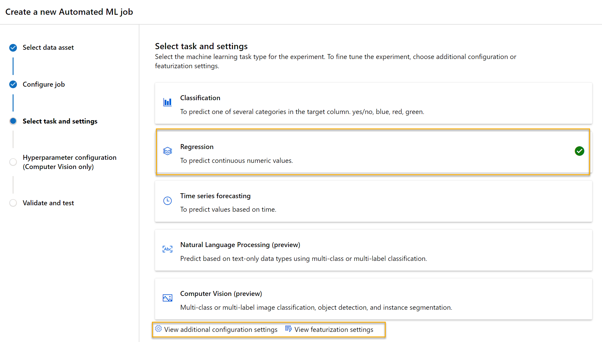

---
lab:
  title: Изучение автоматизированного машинного обучения в Машинном обучении Azure
---

# <a name="explore-automated-machine-learning-in-azure-ml"></a>Изучение автоматизированного машинного обучения в Машинном обучении Azure

> **Примечание** Чтобы выполнить это задание вам потребуется [подписка Azure](https://azure.microsoft.com/free?azure-portal=true), по которой у вас есть административный доступ.

В этом упражнении вы воспользуетесь набором данных из сведений о прокате велосипедов за прошлые периоды, чтобы обучить модель, прогнозирующую ожидаемое число клиентов, берущих напрокат велосипед, в определенный день в зависимости от времени года и погодных условий.

## <a name="create-an-azure-machine-learning-workspace"></a>Создание рабочей области машинного обучения Azure  

1. Войдите на [портал Microsoft Azure](https://portal.azure.com?azure-portal=true) с помощью учетной записи Майкрософт.

1. Нажмите **+ Создать ресурс**, выполните поиск по строке *Машинное обучение* и создайте ресурс **Машинное обучение Azure** с планом *Машинное обучение Azure*. Используйте следующие параметры:
    - **Подписка**: *ваша подписка Azure*.
    - **Группа ресурсов**: *создайте или выберите группу ресурсов*.
    - **Имя рабочей области**: *введите уникальное имя для рабочей области*.
    - **Регион**: *Выберите ближайший к вам географический регион*.
    - **Учетная запись хранения**: *обратите внимание на новую учетную запись хранения по умолчанию, которая будет создана для рабочей области*.
    - **Хранилище ключей**: *обратите внимание на новое хранилище ключей по умолчанию, которое будет создано для рабочей области*.
    - **Application Insights**: *обратите внимание на новый ресурс Application Insights по умолчанию, который будет создан для рабочей области*.
    - **Реестр контейнеров**: нет (*один будет создан автоматически при первом развертывании модели в контейнере*).

1. Выберите **Проверить и создать**, а затем выберите **Создать**. Дождитесь создания рабочей области (это может занять несколько минут), а затем перейдите к развернутому ресурсу.

1. Выберите **Запустить Студию** (или откройте новую вкладку браузера и перейдите по адресу [https://ml.azure.com](https://ml.azure.com?azure-portal=true)), а затем войдите в Студию машинного обучения Azure под своей учетной записью Майкрософт.

1. Если появится сообщение **What are your machine learning goals today?** (Каковы цели машинного обучения сегодня?), нажмите **Отмена**.

1. Если появится приветствие **Welcome to the studio!** (Добро пожаловать в Студию!), нажмите **X**.

1. В Студии машинного обучения Azure вы увидите только что созданную рабочую область. Если нет, щелкните **Майкрософт** в меню слева. Затем в новом меню слева выберите **Рабочие области**. Здесь будут перечислены все рабочие области, связанные с вашей подпиской. Выберите ту, которую вы создали для этого упражнения. 

> **Примечание** В этом модуле, как и в многих других, в том числе в других модулях схемы обучения [Основы ИИ Microsoft Azure. Обзор визуальных средств для машинного обучения](https://docs.microsoft.com/learn/paths/create-no-code-predictive-models-azure-machine-learning/) используется рабочая область Машинного обучения Azure. Если вы используете собственную подписку Azure, можно создать рабочую область и повторно использовать ее в других модулях. В вашей подписке Azure будет начисляться небольшая плата за хранение данных, так как в ней существует рабочая область Машинного обучения Azure. Поэтому мы рекомендуем удалить рабочую область Машинного обучения Azure, когда она будет не нужна.

## <a name="create-compute"></a>Создание вычислений

1. В [Студии машинного обучения Azure](https://ml.azure.com?azure-portal=true) выберите меню с тремя линиями в левом верхнем углу и задайте просмотр различных страниц в интерфейсе. Возможно, потребуется увеличить размер экрана. Страницы на панели слева можно использовать для управления ресурсами в рабочей области. Перейдите на страницу **Вычисления** (в разделе **Управление**).

1. На странице **Вычисления** выберите вкладку **Вычислительные кластеры** и добавьте новый кластер вычислений с указанными ниже параметрами. Он будет использоваться для обучения модели машинного обучения.
    - **Расположение**: *выберите то же, что для рабочей области. Если этого расположения нет в списке, выберите ближайшее к вам*.
    - **Уровень виртуальной машины**: Выделенный.
    - **Тип виртуальной машины**: ЦП
    - **Размер виртуальной машины**:
        - Щелкните **Выбрать из всех параметров**
        - Найдите и выберите **Standard_DS11_v2**
    - Щелкните **Далее**.
    - **Имя вычисления**: *введите уникальное имя*.
    - **Минимальное число узлов**: 0
    - **Максимальное число узлов**: 2
    - **Время до уменьшения масштаба (сек)**: 120
    - **Включить доступ по SSH**: пусто.
    - Выберите **Создать**.

> **Примечание** Вычислительные экземпляры и кластеры создаются на основе стандартных образов виртуальных машин Azure. При работе с этим модулем рекомендуется использовать образ *Standard_DS11_v2*, чтобы достичь оптимального соотношения стоимости и производительности. Если ваша подписка имеет квоту, которая не включает этот образ, выберите другой образ. Но имейте в виду, что использование образа большего размера может увеличить затраты, а образа меньшего размера может быть недостаточно для выполнения этих задач. Либо вы можете попросить администратора Azure увеличить квоту.

Создание кластера вычислений займет некоторое время. В это время можно перейти к следующему шагу.

## <a name="create-a-dataset"></a>Создание набора данных

1. Просмотр данных, разделенных запятыми, в [https://aka.ms/bike-rentals](https://aka.ms/bike-rentals?azure-portal=true) в веб-браузере.

1. В [Студии машинного обучения Azure](https://ml.azure.com?azure-portal=true) разверните левую панель, нажав на значок с тремя линиями в левом верхнем углу экрана. Перейдите на страницу **Данные** (в разделе **Активы**). Эта страница содержит определенные файлы или таблицы, с которыми вы планируете работать в Машинном обучении Azure. Здесь также можно создавать наборы данных.

1. На странице **Данные** на вкладке **Ресурсы данных** нажмите **Создать**. Затем следующие параметры для ресурса данных:
    * **Тип данных**:
        * **Имя**: bike-rentals
        * **Описание**: Данные о прокате велосипедов
        * **Тип набора данных**: табличный
    * **Источник данных**: из веб-файлов.
    * **URL веб-узла**:
        * **URL веб-узла**: [https://aka.ms/bike-rentals](https://aka.ms/bike-rentals?azure-portal=true)
        * **Пропустить проверку данных**: *не выбирайте*.
    * **Параметры**:
        * **Формат файлов**: с разделением
        * **Разделитель**: запятая
        * **Кодирование**: UTF-8
        * **Заголовки столбцов**: заголовки содержит только первый файл
        * **Пропуск строк**: Нет
        * **Набор данных содержит несколько строк**: *не выбирайте этот параметр*
    * **Схема**:
        * включить все столбцы, кроме столбца **Путь**
        * Проверка автоматически обнаруженных типов
    * **Просмотр**
        * Выберите **Создать**.

1. Откройте созданный набор данных и просмотрите страницу **Обзор**, где отображается выборка данных. Эти данные содержат признаки и метки для данных о прокате велосипедов за прошлые периоды.

> **Ссылка**: *эти данные получены от [Capital Bikeshare](https://www.capitalbikeshare.com/system-data) и используются в соответствии с [лицензионным соглашением ](https://www.capitalbikeshare.com/data-license-agreement) в отношении опубликованных данных*.

## <a name="run-an-automated-machine-learning-job"></a>Выполнение эксперимента автоматизированного машинного обучения

Выполните следующие шаги, чтобы запустить задание, использующее автоматизированное машинное обучение для обучения модели регрессии, которая прогнозирует прокат велосипедов.

1. В [студии машинного обучения Azure](https://ml.azure.com?azure-portal=true) перейдите на страницу **Автоматизированное ML** (раздел **Автор**).

1. Создайте задание автоматизированного машинного обучения с указанными ниже параметрами.
    - **Выбор ресурса данных**.
        - **Набор данных**: bike-rentals
    - **Настройка задания**.
        - **Имя нового эксперимента**: mslearn-bike-rental
        - **Целевой столбец**: rentals (*это метка, которую модель должна прогнозировать)*.
        - **Выберите вычислительный кластер Машинного обучения Azure**: *вычислительный кластер, который вы создали ранее*.
    - **Выберите задачу и параметры**: 
        - **Тип задачи**: регрессия *(модель прогнозирует числовое значение)*. 

    

    Обратите внимание, что под типами задач есть разделы параметров *Просмотр дополнительных параметров конфигурации* и *Просмотр параметров конструирования признаков*. Теперь настройте эти параметры.

    - **Дополнительные параметры конфигурации**:
        - **Основная метрика**: выберите **Нормализованная среднеквадратическая погрешность**.
        - **Укажите пояснения для наилучшей модели**: выбрано — *автоматизированное машинное обучение вычисляет важность признаков для наилучшей модели, что позволяет определить влияние каждого признака на прогнозируемую метку.*
        - **Использовать все поддерживаемые модели**: <u>не</u> выбрано. *Вы ограничите задание, чтобы опробовать только несколько конкретных алгоритмов.*
        - **Допустимые модели**: *выберите только **RandomForest** и **LightGBM**. Обычно следует испробовать как можно больше моделей, но каждая добавленная модель увеличивает время, затрачиваемое на выполнение задание.*

        
        - **Критерий выхода**:
            - **Время задания обучения (в часах)** : 0,5.*Задание должно завершиться максимум через 30 минут.*
            - **Порог оценки метрики**: 0,085. *Задание завершается, если метрика нормализованной среднеквадратической погрешности в модели достигает значения 0,085 или меньше.*
        - **Параллелизм**: *не изменяйте.*
    - **Параметры конструирования признаков:**
        - **Включить конструирование признаков**: выбрано — *автоматическая предварительная обработка признаков перед обучением.*

    Щелкните **Далее**, чтобы перейти к следующей области выделения.

    - **Выбор типа проверки и теста**
        - **Тип проверки**: Автоматический
        - **Ресурс тестовых данных (предварительная версия):** : ресурс тестовых данных не требуется.

1. После завершения отправки сведений о задании машинного обучения оно запускается автоматически. Дождитесь, когда состояние *Подготовка* изменится на *Выполнение*.

1. Когда состояние изменится на *Выполнение*, просмотрите вкладку **Модели** и наблюдайте за тем, как выполняются все возможные комбинации алгоритма обучения и действий по предварительной обработке и оценивается производительность результирующей модели. Страница автоматически обновляется, но вы можете нажать кнопку **Обновить**. Запуск моделей может занять около 10 минут, так как перед началом обучения необходимо инициализировать узлы кластера.

1. Дождитесь остановки задания. Это может занять некоторое время, так что можете побаловать себя чашечкой кофе!

## <a name="review-the-best-model"></a>Проверка наилучшей модели

1. На вкладке **Обзор** задания автоматизированного машинного обучения изучите сводку по самой лучшей модели.
    

    >[!NOTE]
    > Может появиться сообщение с текстом "Warning: User specified exit score reached…" (Предупреждение! Достигнута оценка выхода, указанная пользователем…). Это ожидаемое сообщение. После этого перейдите к следующему шагу.  
1. Выберите текст в разделе **Имя алгоритма** для лучшей модели, чтобы просмотреть сведения о ней.

1. Рядом со значением *Нормализованная среднеквадратическая погрешность* выберите **Просмотреть остальные метрики**, чтобы увидеть значения других возможных метрик оценки для модели регрессии.

    

1. Перейдите на вкладку **Метрики** и выберите диаграммы **residuals** и **predicted_true**, если они еще не выбраны. 
    

    Изучите диаграммы, показывающие производительность модели. Первая диаграмма показывает *остатки* — различия между прогнозируемыми и фактическими значениями — в виде гистограммы, а вторя диаграмма сравнивает прогнозируемые значения с истинными.

1. Перейдите на вкладку **Пояснения**. Выберите идентификатор, а затем нажмите **Совокупная важность признаков**. На диаграмме вы увидите, насколько каждый признак в наборе данных влияет на прогнозирование меток.

    

## <a name="deploy-a-predictive-service"></a>Развертывание прогнозной службы

1. В [Студии машинного обучения Azure](https://ml.azure.com?azure-portal=true) на странице **Автоматизированное машинное обучение** запустите соответствующее задание.

1. На вкладке **Обзор** выберите имя алгоритма самой лучшей модели.

    

1. На вкладке **Модель** нажмите на кнопку **Развернуть** и используйте параметр **Развернуть в веб-службе**, чтобы развернуть модель с указанными ниже параметрами.
    - **Имя**: predict-rentals
    - **Описание**: Прогнозирование проката велосипедов
    - **Тип вычисления**: Экземпляр контейнера Azure
    - **Включение проверки подлинности**: Выбрано

1. Подождите, пока начнется развертывание. Это может занять несколько секунд. Затем в разделе **Сводка по модели** просмотрите **Состояние развертывания** для службы **predict-rentals**, которое должно иметь значение **Выполнение**. Дождитесь, пока состояние изменится на **Успешно**. На это может потребоваться некоторое время. Возможно, потребуется время от времени нажимать на кнопку **Обновить**.

1. В Студии машинного обучения Azure в меню слева выберите **Конечные точки**.
    

## <a name="test-the-deployed-service"></a>Тестирование развернутой службы

Теперь можно протестировать развернутую службу.

1. На странице **Конечные точки** откройте конечную точку в реальном времени **predict-rentals**.

1. При открытии конечной точки **predict-rentals**, посмотрите вкладку **Тест**.

1. В области **Входные данные для тестирования конечной точки для прогнозирования в реальном времени** замените шаблон JSON указанными ниже входными данными.

    ```JSON
    {
      "Inputs": { 
        "data": [
          {
            "day": 1,
            "mnth": 1,   
            "year": 2022,
            "season": 2,
            "holiday": 0,
            "weekday": 1,
            "workingday": 1,
            "weathersit": 2, 
            "temp": 0.3, 
            "atemp": 0.3,
            "hum": 0.3,
            "windspeed": 0.3 
          }
        ]    
      },   
      "GlobalParameters": 1.0
    }
    ```

1. Нажмите кнопку **Проверить**.

1. Проверьте результаты теста, которые включают прогнозируемое количество прокатов на основе входных функций. На панели тестирования были введены входные данные и использована модель, обученная для возврата прогнозируемого числа прокатов.

    

Давайте посмотрим, что у вас получилось. Для обучения модели использовался набор данных об аренде велосипедов за прошедшие периоды. Модель прогнозирует ожидаемого количество велосипедов, взятых напрокат в течение определенного дня, на основе сезонных и метеорологических *признаков*. В этом случае *метками* является количество велосипедов, взятых напрокат.

Вы протестировали службу, и теперь ее можно подключить к клиентскому приложению с помощью учетных данных на вкладке **Использование**. На этом задание завершено. Вы можете продолжить эксперимент с только что развернутой службой.

## <a name="clean-up"></a>Очистка

Созданная веб-служба размещается в *экземпляре контейнера Azure*. Если вы не планируете экспериментировать с ним и дальше, следует удалить конечную точку, чтобы избежать лишнего использования ресурсов Azure. Кроме того, нужно остановить вычислительный экземпляр до тех пор, пока он снова не понадобится.

1. В [студии машинного обучения Azure](https://ml.azure.com?azure-portal=true) на вкладке **Конечные точки** выберите конечную точку **predict-rentals**. Затем щелкните **Удалить** и подтвердите удаление конечной точки.
2. На странице **Вычисления** (вкладка **Вычислительные экземпляры**) выберите вычислительный экземпляр и нажмите **Остановить**.

>[!NOTE]
> Остановка вычислений гарантирует, что в вашей подписке не будет начисляться плата за вычислительные ресурсы. Однако с вас будет взиматься небольшая плата за хранение данных, так как в вашей подписке существует рабочая область Машинного обучения Azure. Если вы завершили изучение возможностей Машинного обучения Azure, можно удалить рабочую область Машинного обучения Azure и связанные с ней ресурсы. Но если вы планируете выполнять другие задания из этой серии, вам нужно будет создать рабочую область повторно.
>
> Чтобы удалить рабочую область:
> 1. На [портале Microsoft Azure](https://portal.azure.com?azure-portal=true) (страница **Группы ресурсов**) откройте группу ресурсов, указанную при создании рабочей области машинного обучения Azure.
> 2. Щелкните **Удалить группу ресурсов**, введите имя группы ресурсов, чтобы подтвердить ее удаление, и выберите **Удалить**.