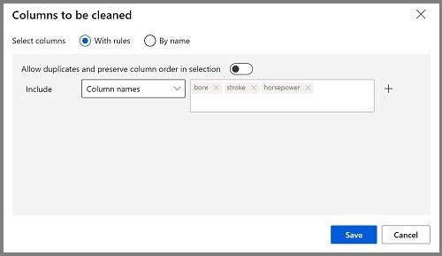

---
lab:
  title: Изучение регрессии с помощью конструктора Машинного обучения Azure
---

# Изучение регрессии с помощью конструктора Машинного обучения Azure

> **Примечание**. Для выполнения этого задания вам потребуется [подписка Azure](https://azure.microsoft.com/free?azure-portal=true), в которой у вас есть административный доступ.

В этом упражнении вы обучите модель регрессии, которая прогнозирует цену автомобиля на основе его характеристик.

## Создание рабочей области машинного обучения Azure  

1. Войдите на [портал Microsoft Azure](https://portal.azure.com?azure-portal=true) с помощью учетной записи Майкрософт.

1. Нажмите **+ Создать ресурс**, выполните поиск по строке *Машинное обучение* и создайте ресурс **Машинное обучение Azure** с планом *Машинное обучение Azure*. Используйте следующие параметры:
    - **Подписка**: *ваша подписка Azure*.
    - **Группа ресурсов**: *создайте или выберите группу ресурсов*.
    - **Имя рабочей области**: *введите уникальное имя для рабочей области*.
    - **Регион**: *выберите ближайший к вам географический регион*.
    - **Учетная запись хранения**: *обратите внимание на новую учетную запись хранения по умолчанию, которая будет создана для рабочей области*.
    - **Хранилище ключей**: *обратите внимание на новое хранилище ключей по умолчанию, которое будет создано для рабочей области*.
    - **Application Insights**: *обратите внимание на новый ресурс Application Insights по умолчанию, который будет создан для рабочей области*.
    - **Реестр контейнеров**. Нет (*один будет создан автоматически при первом развертывании модели в контейнере*).

1. Выберите **Проверить и создать**, а затем выберите **Создать**. Дождитесь создания рабочей области (это может занять несколько минут), а затем перейдите к развернутому ресурсу.

1. Выберите **Запустить Студию** (или откройте новую вкладку браузера и перейдите по адресу [https://ml.azure.com](https://ml.azure.com?azure-portal=true)), а затем войдите в Студию машинного обучения Azure, используя свою учетную запись Майкрософт.

1. В Студии машинного обучения Azure вы увидите только что созданную рабочую область. Если это не так, выберите каталог Azure в меню слева. Затем в новом меню слева выберите **Рабочие области**, где перечислены все рабочие области, связанные с вашим каталогом, и выберите ту, которую вы создали для этого упражнения.

> **Примечание** В этом модуле, как и в многих других, в том числе в других модулях схемы обучения [Основы ИИ Microsoft Azure. Обзор визуальных средств для машинного обучения](https://docs.microsoft.com/learn/paths/create-no-code-predictive-models-azure-machine-learning/) используется рабочая область Машинного обучения Azure. Если вы используете собственную подписку Azure, можно создать рабочую область и повторно использовать ее в других модулях. В вашей подписке Azure будет начисляться небольшая плата за хранение данных, так как в ней существует рабочая область Машинного обучения Azure. Поэтому мы рекомендуем удалить рабочую область Машинного обучения Azure, когда она будет не нужна.

## Создание вычислений

1. В [Студия машинного обучения Azure](https://ml.azure.com?azure-portal=true) щелкните значок **&#8801;** (значок меню, который выглядит как стек из трех строк) в левом верхнем углу, чтобы просмотреть различные страницы в интерфейсе (может потребоваться увеличить размер экрана). Страницы на панели слева можно использовать для управления ресурсами в рабочей области. Перейдите на страницу **Вычисления** (в разделе **Управление**).

1. На странице **Вычисления** выберите вкладку **Вычислительные кластеры** и добавьте новый вычислительный кластер со следующими параметрами, чтобы обучить модель машинного обучения:
    - **Расположение**: *выберите то же, что для рабочей области. Если этого расположения нет в списке, выберите ближайшее к вам*.
    - **Уровень виртуальной машины**: Выделенный.
    - **Тип виртуальной машины**: ЦП
    - **Размер виртуальной машины**:
        - Щелкните **Выбрать из всех параметров**
        - Найдите и выберите **Standard_DS11_v2**
    - Щелкните **Далее**.
    - **Имя вычисления**: *введите уникальное имя*
    - **Минимальное число узлов**: 0
    - **Максимальное число узлов**: 2
    - **Время до уменьшения масштаба (сек)**: 120
    - **Включить доступ по SSH**: пусто.
    - Выберите **Создать**.

> **Примечание** Вычислительные экземпляры и кластеры создаются на основе стандартных образов виртуальных машин Azure. При работе с этим модулем рекомендуется использовать образ *Standard_DS11_v2*, чтобы достичь оптимального соотношения стоимости и производительности. Если ваша подписка имеет квоту, которая не включает этот образ, выберите другой образ. Но имейте в виду, что использование образа большего размера может увеличить затраты, а образа меньшего размера может быть недостаточно для выполнения этих задач. Либо вы можете попросить администратора Azure увеличить квоту.

Создание кластера вычислений займет некоторое время. В это время можно перейти к следующему шагу.

## Создание конвейера в Designer и добавление набора данных

Машинное обучение Azure включает пример набора данных, который можно использовать для модели регрессии.

1. В [Студия машинного обучения Azure](https://ml.azure.com?azure-portal=true) разверните левую панель, щелкнув значок меню в левом верхнем углу экрана. Просмотрите страницу **Designer** (в разделе **Разработка**) и выберите **+** , чтобы создать новый конвейер.

1. Измените имя черновика (**Pipeline-Created-on-date***) на **Auto Price Training**.

1. Рядом с именем конвейера слева щелкните значок стрелок, чтобы развернуть панель, если она еще не развернута. Панель должна открываться по умолчанию в области **Библиотека ресурсов**, обозначенной значком книг в верхней части панели. На панели находится строка поиска ресурсов, а также две кнопки, **Данные** и **Компонент**.

    

1. Выберите **Компонент**. Найдите набор данных **Данные о ценах автомобилей (RAW)** и поместите его на холст.

1. Щелкните правой кнопкой мыши (ctrl+щелчок на компьютере Mac) набор **данных о ценах на автомобили (необработанные)** на холсте и выберите **Предварительный просмотр данных**.

1. Просмотрите схему *Выходной набор данных* и обратите внимание, что распределения для нескольких столбцов отображаются как гистограммы.

1. Прокрутите до правой части набора данных, пока не увидите столбец **Цена**, который является меткой, прогнозируемой моделью.

1. Прокрутите страницу влево и выберите заголовок столбца **normalized-losses**. Затем просмотрите статистику для этого столбца. Обратите внимание, что в этом столбце довольно много отсутствующих значений. Они ограничивают полезность столбца при прогнозировании метки **цена**, поэтому может потребоваться исключить его из обучения.

1. Закройте окно **DataOutput** , чтобы увидеть набор данных на холсте следующим образом:

    

## Добавление преобразования данных

Обычно преобразования данных применяются для подготовки данных для моделирования. В случае с данными о ценах на автомобили вы добавляете преобразования для устранения проблем, обнаруженных при просмотре данных.

1. В области **Библиотека ресурсов** слева выберите **Компонент**, который содержит широкий спектр модулей, которые можно использовать для преобразования данных и обучения модели. Можно также использовать панель поиска для быстрого поиска модулей.

1. Найдите модуль **Выбрать столбцы в наборе данных** и поместите его на холст, под модулем **Данные о ценах на автомобиль (RAW)**. Затем подсоедините выходные данные в нижней части модуля **Данные о ценах на автомобили (необработанные)** к входным данным в верхней части модуля **Выбор столбцов в наборе данных**, например:

    

1. Дважды щелкните модуль **Выбор столбцов в наборе данных**, чтобы открыть соответствующую панель справа. Щелкните **Изменить столбец**. Теперь в окне **Выбор столбцов** выберите **По имени** и **Добавить все**, чтобы добавить все столбцы. Затем удалите **normalized-losses**, и теперь выбор столбцов будет выглядеть следующим образом:

    

1. Нажмите **кнопку Сохранить** и закройте окно с собственными свойствами.

В оставшейся части этого упражнения вы выполните действия по созданию конвейера, который должен выглядеть следующим образом:


Выполните оставшиеся шаги инструкции, используя рисунок в качестве справки по добавлению и настройке необходимых модулей.

1. В разделе **Библиотека ресурсов** выполните поиск по имени модуля **Очистка отсутствующих данных** и поместите его на холст под модулем **Выбор столбцов в наборе данных**. Затем подключите область выходных данных модуля **Выбор столбцов в наборе данных** в области входных данных модуля **Очистка отсутствующих данных**.

1. Дважды щелкните модуль **Очистка недостающих данных** и в области справа выберите **Изменить столбец**. Затем в окне **Столбцы для очистки** выберите **С правилами**, в списке **Включить** выберите **Имена столбцов**, в поле имен столбцов введите **bore**, **stroke** и **horsepower**, как показано ниже:

    

1. Выберите модуль **Очистка отсутствующих данных**, а затем в области параметров задайте следующие параметры конфигурации:
    - **Минимальная доля отсутствующих значений**: 0,0
    - **Максимальная доля отсутствующих значений**: 1,0
    - **Режим очистки**: Удаление целой строки

    >**Tip** Открыв статистику для столбцов **bore**, **stroke** и **horsepower**, вы увидите несколько отсутствующих значений. Эти столбцы содержат меньше отсутствующих значений, чем **normalized-losses**, поэтому они могут быть полезны при прогнозировании **цены**, если исключить строки с отсутствующими значениями из процесса обучения.

1. В **библиотеке ресурсов** найдите модуль **Нормализация данных** и поместите его на холст ниже модуля **Очистка отсутствующих данных**. Затем подключите крайнюю слева область выходных данных модуля **Очистка отсутствующих данных** к области входных данных модуля **Нормализация данных**.

1. Дважды щелкните модуль **Нормализация данных**, чтобы открыть для него панель параметров. Понадобится указать метод преобразования и столбцы, которые необходимо преобразовать. Задайте в качестве метода преобразования **MinMax**. Примените правило, выбрав **Изменить столбец**, и добавив следующие **имена столбцов**:
    - **symboling**
    - **wheel-base (колесная база);**
    - **length**
    - **width**
    - **height**
    - **curb-weight**
    - **engine-size (объем двигателя);**
    - **bore**
    - **stroke**
    - **compression-ratio**
    - **horsepower**
    - **peak-rpm (пиковое значение об/мин);**
    - **city-mpg**
    - **highway-mpg (расход топлива за городом).**

    

    >**Совет**. Сравнивая значения в столбцах **stroke**, **peak-rpm** и **city-mpg**, можно обратить внимание, что они оцениваются по разным шкалам, более высокие значения **peak-rpm** могут вызывать смещение в алгоритме обучения, то есть чрезмерную зависимость результата от этого столбца по сравнению со столбцами, где значения существенно ниже, как например **stroke**. Как правило, специалисты по обработке и анализу данных снижают этот возможный сдвиг, выполняя *нормализацию* числовых столбцов, чтобы они использовали одну и ту же шкалу.

## Запуск конвейера

Чтобы применить преобразования данных, необходимо запустить конвейер.

1. Убедитесь, что конвейер выглядит примерно как на этом изображении:

    

1. Выберите **Настроить & Отправить** в верхней части страницы, чтобы открыть диалоговое окно **Настройка задания конвейера** .

1. На странице **Основные сведения** выберите **Создать и** задайте для эксперимента имя **mslearn-auto-training** , а затем нажмите кнопку **Далее** .

1. На странице **Входные & выходные данные** нажмите **кнопку Далее** , не внося никаких изменений.

1. На странице **Параметры среды выполнения** отображается сообщение об ошибке, так как у вас нет вычислительных ресурсов по умолчанию для запуска конвейера. В раскрывающемся списке **Выбор типа вычислений** выберите *Вычислительный кластер* , а в раскрывающемся списке **Выбор вычислительного кластера Машинного обучения Azure** выберите недавно созданный вычислительный кластер.

1. Нажмите **кнопку Далее** , чтобы просмотреть задание конвейера, а затем нажмите кнопку **Отправить** , чтобы запустить конвейер обучения.

1. Подождите несколько минут, пока не завершится выполнение. Вы можете проверка состояние задания, выбрав **Задания** в разделе **Активы**. Затем выберите задание **Автоматическое обучение ценам** . Здесь можно увидеть, когда задание будет завершено. После завершения задания набор данных подготавливается для обучения модели.

1. Перейдите в меню слева. В разделе **Разработка** выберите **Designer**. Затем выберите конвейер *Автоматическое обучение ценам* в списке **Конвейеры**.

## Создание конвейера обучения

После подготовки данных с помощью преобразований эти данные можно использовать для обучения модели машинного обучения. Выполните следующие действия, чтобы расширить конвейер **Обучение модели цен на автомобили**.

1. Убедитесь, что в меню слева **выбрано Designer** и что вы вернулись к конвейеру **Автоматическое обучение ценам**.

1. На панели **Библиотека ресурсов** слева найдите и поместите модуль **Разделение данных** на холст под модуль **Нормализация данных**. Затем подключите область выходных данных *Преобразованный набор данных* (слева) модуля **Нормализация данных** к области входных данных модуля **Разделение данных**.

    >**Совет**. Используйте панель поиска для быстрого поиска модулей. 

1. Дважды щелкните модуль **Разделение данных** и настройте его параметры следующим образом.
    - **Режим разделения**: разделение строк
    - **Часть строк в первом наборе выходных данных**: 0,7
    - **Случайное разделение**: да
    - **Случайное начальное значение**: 123
    - **Стратифицированное разделение**: Неверно

1. В **Библиотеке ресурсов** найдите и поместите модуль **Обучение модели** на холст под модуль **Разделение данных**. Затем подключите область выходных данных *Результирующий набор данных1* (слева) модуля **Разделение данных** к области входных данных *Набор данных* (справа) модуля **Обучение модели**.

1. Обучаемая модель будет прогнозировать значение **price** (цена), поэтому выберите модуль **Обучение модели** и измените его параметры, чтобы задать для параметра **Столбец меток** значение **price** (обязательно соблюдайте регистр и правописание).

    Метка **Цена**, которую будет прогнозировать модель, представляет собой числовое значение, поэтому нам необходимо обучить модель, используя алгоритм *регрессии*.

1. В **библиотеке ресурсов** найдите и поместите модуль **Линейная регрессия** на холст слева от модуля **Разделение данных** и над модулем **Обучение модели**. После этого подключите область его выходных данных к области входных данных **Необученная модель** (слева) модуля **Обучение модели**.

    > **Примечание**. Для обучения модели регрессии можно использовать несколько алгоритмов. Инструкции по выбору алгоритма см. в разделе [Памятка по алгоритмам машинного обучения для конструктора машинного обучения Azure](https://aka.ms/mlcheatsheet?azure-portal=true).

    Для проверки обученной модели необходимо использовать ее для *оценки* проверочного набора данных, оставленных на этапе разделения исходных данных — то есть для прогнозирования меток для признаков в проверочном наборе данных.
 
1. В **Библиотеке ресурсов** найдите и поместите модуль **Оценка модели** на холст под модулем **Обучение модели**. Затем подключите область выходных данных модуля **Обучение модели** к входным данным модуля **Обученная модель** (слева) модуля **Оценка модели** и перенесите область выходных данных модуля **Результирующий набор данных2** (справа) модуля **Разделение данных** к области входных данных **Набор данных** (справа) модуля **Оценка модели**.

1. Убедитесь, что конвейер выглядит следующим образом:

    

## Запуск конвейера обучения

Теперь все готово для запуска конвейера обучения и процесса обучения модели.

1. Выберите **Настроить & Отправить** и запустите конвейер, используя существующий эксперимент **с именем mslearn-auto-training**.

1. Выполнение эксперимента займет около 5 минут. Вернитесь на страницу **Задания** и выберите последнее выполнение задания **Автоматическое обучение ценам** .

1. Когда выполнение эксперимента завершится, щелкните правой кнопкой мыши модуль **Оценка модели** и выберите **Предварительный просмотр данных** , а затем **— Оцененный набор данных** , чтобы просмотреть результаты.

1. Прокрутите экран вправо и обратите внимание, что рядом со столбцом **цена** (который содержит известные значения TRUE для метки) отображается новый столбец с именем **Метки с оценкой**, где содержатся спрогнозированные значения меток.

1. Закройте вкладку **scored_dataset** .

Модель прогнозирует значения для метки **цена**, но насколько надежны такие прогнозы? Чтобы оценить их надежность, необходимо проанализировать модель.

## Анализ модели

Один из способов оценить модель регрессии — сравнить прогнозируемые метки с фактическими метками в проверочном наборе данных, который был удержан во время обучения. Также можно сравнить производительность нескольких моделей.

1. Откройте созданный конвейер **Обучение модели цен на автомобили**.

1. В разделе **Библиотека ресурсов** выполните поиск по имени модуля **Анализ модели** и поместите его на холст под модулем **Оценка модели**, а затем соедините выход модуля **Оценка модели** с входом **Оцененный набор данных** (слева) модуля **Анализ модели**.

1. Убедитесь, что конвейер выглядит следующим образом:

    

1. Выберите **Настроить & Отправить** и запустите конвейер, используя существующий эксперимент **с именем mslearn-auto-training**.

1. Выполнение эксперимента займет несколько минут. Вернитесь на страницу **Задания** и выберите последнее выполнение задания **Автоматическое обучение ценам** .

1. После завершения выполнения эксперимента выберите **Сведения о задании**, после чего откроется другая вкладка. Найдите модуль **Оценка модели** и щелкните его правой кнопкой мыши. Выберите **Предварительный просмотр данных**, а затем — **Результаты оценки**.

    

1. На панели *Evaluation_results* изучите метрики производительности для регрессии:
    - **Средняя абсолютная погрешность (MAE)**
    - **Корень среднеквадратической погрешности (RMSE)**
    - **Относительная квадратическая погрешность (RSE)**
    - **Относительная абсолютная погрешность (RAE)**
    - **Коэффициент детерминации (R<sup>2</sup>)**
1. Закройте область *Evaluation_results*.

После определения модели с оценочными показателями, соответствующими вашим потребностям, можно подготовиться к использованию этой модели с новыми данными.

## Создание и запуск конвейера вывода

1. Найдите меню над холстом и выберите **Создать конвейер вывода**. Возможно, потребуется развернуть экран в полноэкранный режим и щелкнуть значок с тремя точками **...** в правом верхнем углу экрана, чтобы найти команду **Создать конвейер вывода** в меню.  

    

1. В раскрывающемся списке **Создание конвейера вывода** выберите **Конвейер вывода в режиме реального времени**. Через несколько секунд откроется новая версия конвейера с именем **Обучение модели цен на автомобили — вывод в реальном времени**.

1. Переименуйте новый конвейер в **Прогнозирование цен на автомобиль**, а затем просмотрите новый конвейер. Он содержит входные данные веб-службы для новых отправляемых данных, а также выходные данные веб-службы для возврата результатов. Некоторые преобразования и этапы обучения являются частью этого конвейера. Обученная модель будет использоваться для оценки новых данных.

    На следующих шагах вы внесете следующие изменения в конвейер вывода.

    

   Используйте образ для справки при изменении конвейера на следующих шагах.

1. При использовании конвейера вывода предполагается, что новые данные соответствуют схеме исходных данных обучения, то есть набор данных **Данные о ценах на автомобиль (необработанные)** из конвейера обучения включен. Однако эти входные данные содержат метку **цена**, которая не включается интуитивно в данные нового автомобиля, для которого еще не сформирован прогноз. Удалите этот модуль и замените его модулем **Ввод данных вручную** в разделе **Входные и выходные данные** .
1. Измените модуль **Ввод данных вручную** и введите следующие данные CSV, которые включают значения признаков без меток для трех автомобилей (скопируйте и вставьте весь блок текста):

    ```CSV
    symboling,normalized-losses,make,fuel-type,aspiration,num-of-doors,body-style,drive-wheels,engine-location,wheel-base,length,width,height,curb-weight,engine-type,num-of-cylinders,engine-size,fuel-system,bore,stroke,compression-ratio,horsepower,peak-rpm,city-mpg,highway-mpg
    3,NaN,alfa-romero,gas,std,two,convertible,rwd,front,88.6,168.8,64.1,48.8,2548,dohc,four,130,mpfi,3.47,2.68,9,111,5000,21,27
    3,NaN,alfa-romero,gas,std,two,convertible,rwd,front,88.6,168.8,64.1,48.8,2548,dohc,four,130,mpfi,3.47,2.68,9,111,5000,21,27
    1,NaN,alfa-romero,gas,std,two,hatchback,rwd,front,94.5,171.2,65.5,52.4,2823,ohcv,six,152,mpfi,2.68,3.47,9,154,5000,19,26
    ```

1. Подключите новый модуль **Ввод данных вручную** к тому же входному **набору данных** модуля **Выбор столбцов в наборе данных** , что и **входные данные веб-службы**.

1. Теперь, когда вы изменили схему входящих данных, чтобы исключить поле **Цена**, необходимо удалить все случаи явного использования этого поля в остальных модулях. Выберите модуль **Выбрать столбцы в наборе данных**, а затем в области "Параметры" измените столбцы, чтобы удалить поле **Цена**.

1. Конвейер вывода содержит модуль **Анализ модели**, который не рекомендуется использовать при прогнозировании на основе новых данных. Таким образом, этот модуль следует удалить.

1. Выходные данные модуля **Оценка модели** включают все компоненты входных данных, а также прогнозируемую метку. Чтобы изменить выходные данные, чтобы они включали только прогноз:
    - Удалите связь между модулями **Оценка модели** и **Выходные данные веб-службы**.
    - Добавьте модуль **Выполнение сценария Python** из раздела **Язык Python**, заменив все сценарии Python по умолчанию на следующий код (выбирает только столбцы **Метки с оценкой** и переименовывает их в **predicted_price**):

    ```Python
    import pandas as pd

    def azureml_main(dataframe1 = None, dataframe2 = None):

        scored_results = dataframe1[['Scored Labels']]
        scored_results.rename(columns={'Scored Labels':'predicted_price'},
                        inplace=True)
     return scored_results
    ```
>**Примечание**. Копирование и вставка могут привести к созданию пробелов в скрипте Python, которые не должны быть там. Double проверка, что перед *импортом*, *дефированием* или *возвратом* нет места. Убедитесь, что перед *scored_results* есть один отступ табуляции и *scored_results.rename()*.

1. Подключите выходные данные модуля **Score Model (Оценка модели** ) к входным данным **dataset1** (самый левый) для **выполнения скрипта Python**.

1. Подключите выходные **данные результирующий набор данных** (слева) модуля **Выполнение скрипта Python** к модулю **выходных данных веб-службы** .

1. Убедитесь, что конвейер выглядит примерно следующим образом:

    

1. Отправьте конвейер как новый эксперимент с именем **mslearn-auto-inference** в вычислительном кластере. Выполнение эксперимента может занять некоторое время.

1. Вернитесь на страницу **Задания** и выберите последнее выполнение задания **автоматического обучения цен** (связанное с *экспериментом mslearn-auto-inference*).

1. После завершения конвейера щелкните правой кнопкой мыши модуль **Выполнение скрипта Python** . Щелкните **Предварительный просмотр данных**, а затем **Результирующий набор данных**, чтобы просмотреть прогнозируемые цены для трех автомобилей, предоставленных во входных данных.

1. Закройте вкладку **Result_Dataset** .

Ваш конвейер вывода прогнозирует цены на автомобили на основе их функций. Теперь все готово для публикации конвейера и его дальнейшего использования клиентскими приложениями.

## Развертывание модели

После создания и тестирования конвейера вывода в режиме реального времени можно опубликовать его как службу и использовать в клиентских приложениях.

> **Примечание** В этом упражнении вы развернете веб-службу в экземпляре контейнера Azure. Этот тип вычислений создается динамически и он полезен для разработки и тестирования. В рабочей среде следует создать *кластер вывода*, который предоставляет кластер Azure Kubernetes Service (AKS), обеспечивающий лучшую масштабируемость и безопасность.

## Развертывание службы

1. На странице **Запуск задания Прогнозирование автоматической цены** выберите **Развернуть** в верхней строке меню.

    

1. На экране конфигурации выберите **Развернуть новую конечную точку в режиме реального времени** и используйте следующие параметры:
    - **Имя**: predict-auto-price
    - **Описание**: "Регрессия цен на автомобили"
    - **Тип вычисления**: Экземпляр контейнера Azure

1. Выберите **Развернуть** и подождите несколько минут, пока веб-служба не будет развернута.

## Тестирование службы

1. На странице **Конечные точки** откройте конечную точку в реальном времени **predict-auto-price**.

    

1. Когда откроется конечная точка **predict-auto-price**, перейдите на вкладку **Тест**, где мы выполним тестирование модели с новыми данными. Удалите текущие данные в разделе **Входные данные для тестирования конечной точки**. Скопируйте и вставьте в раздел данных приведенные ниже данные:  

    ```json
    {
    "Inputs": {
                "WebServiceInput0":
                [
                    {
                        "symboling": 3,
                        "normalized-losses": 1.0,
                        "make": "alfa-romero",
                        "fuel-type": "gas",
                        "aspiration": "std",
                        "num-of-doors": "two",
                        "body-style": "convertible",
                        "drive-wheels": "rwd",
                        "engine-location": "front",
                        "wheel-base": 88.6,
                        "length": 168.8,
                        "width": 64.1,
                        "height": 48.8,
                        "curb-weight": 2548,
                        "engine-type": "dohc",
                        "num-of-cylinders": "four",
                        "engine-size": 130,
                        "fuel-system": "mpfi",
                        "bore": 3.47,
                        "stroke": 2.68,
                        "compression-ratio": 9,
                        "horsepower": 111,
                        "peak-rpm": 5000,
                        "city-mpg": 21,
                        "highway-mpg": 27
                    }
                ]
            },
    "GlobalParameters": {}
    }
    ```

1. Выберите **Тест**. В правой части экрана должны отобразиться выходные данные **predicted_price**. Эти выходные данные содержат прогноз цены за транспортное средство, характеристики которого указаны во входных данных.

    

Давайте посмотрим, что у вас получилось. Вы очистили и преобразовали набор данных об автомобилях, а затем обучили модель с помощью их *характеристик*. Модель прогнозирует цену на автомобиль, создавая *метку*.

Вы также протестировали службу, которую можно подключить к клиентскому приложению с помощью данных для входа на вкладке **Использование**. На этом задание завершено. Вы можете продолжить эксперимент с только что развернутой службой.

## Очистка

Созданная веб-служба размещается в *экземпляре контейнера Azure*. Если вы не планируете экспериментировать с ним и дальше, следует удалить конечную точку, чтобы избежать лишнего использования ресурсов Azure. Необходимо также удалить вычислительный кластер.

1. В [студии машинного обучения Azure](https://ml.azure.com?azure-portal=true) на вкладке **Конечные точки** выберите конечную точку **predict-auto-price**. Затем щелкните **Удалить** и подтвердите удаление конечной точки.

1. На странице **Вычисления** на вкладке **Вычислительные кластеры** выберите кластер вычислений и нажмите **Удалить**.

>**Примечание** Удаление вычислительных ресурсов гарантирует, что с вашей подписки не будет взиматься плата за вычислительные ресурсы. Однако с вас будет взиматься небольшая плата за хранение данных, так как в вашей подписке существует рабочая область Машинного обучения Azure. Если вы завершили изучение возможностей Машинного обучения Azure, можно удалить рабочую область Машинного обучения Azure и связанные с ней ресурсы. Но если вы планируете выполнять другие задания из этой серии, вам нужно будет создать рабочую область повторно.
>
> Чтобы удалить рабочую область:
>
> 1. На [портале Microsoft Azure](https://portal.azure.com?azure-portal=true) (страница **Группы ресурсов**) откройте группу ресурсов, указанную при создании рабочей области машинного обучения Azure.
> 1. Щелкните **Удалить группу ресурсов**, введите имя группы ресурсов, чтобы подтвердить ее удаление, и выберите **Удалить**.
