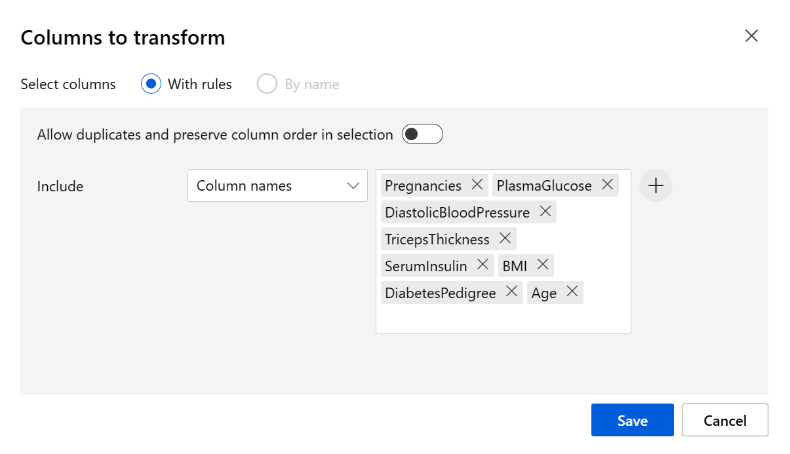

---
lab:
  title: Изучение классификации с помощью конструктора Машинного обучения Azure
---

# Изучение классификации с помощью конструктора Машинного обучения Azure

> **Примечание** Чтобы выполнить это задание вам потребуется [подписка Azure](https://azure.microsoft.com/free?azure-portal=true), по которой у вас есть административный доступ.

## Создание рабочей области машинного обучения Azure  

1. Войдите на [портал Microsoft Azure](https://portal.azure.com?azure-portal=true) с помощью учетной записи Майкрософт.

1. Нажмите **+ Создать ресурс**, выполните поиск по строке *Машинное обучение* и создайте ресурс **Машинное обучение Azure** с планом *Машинное обучение Azure*. Используйте следующие параметры:
    - **Подписка**: *ваша подписка Azure*.
    - **Группа ресурсов**: *создайте или выберите группу ресурсов*.
    - **Имя рабочей области**: *введите уникальное имя для рабочей области*.
    - **Регион**: *выберите ближайший к вам географический регион*.
    - **Учетная запись хранения**: *обратите внимание на новую учетную запись хранения по умолчанию, которая будет создана для рабочей области*.
    - **Хранилище ключей**: *обратите внимание на новое хранилище ключей по умолчанию, которое будет создано для рабочей области*.
    - **Application Insights**: *обратите внимание на новый ресурс Application Insights по умолчанию, который будет создан для рабочей области*.
    - **Реестр контейнеров**. Нет (*один будет создан автоматически при первом развертывании модели в контейнере*).

1. Выберите **Проверить и создать**, а затем выберите **Создать**. Дождитесь создания рабочей области (это может занять несколько минут), а затем перейдите к развернутому ресурсу.

1. Выберите **Запустить Студию** (или откройте новую вкладку браузера и перейдите по адресу [https://ml.azure.com](https://ml.azure.com?azure-portal=true)), а затем войдите в Студию машинного обучения Azure, используя свою учетную запись Майкрософт.

1. В Студии машинного обучения Azure вы увидите только что созданную рабочую область. Если это не так, выберите каталог Azure в меню слева. Затем в новом меню слева выберите **Рабочие области**, где перечислены все рабочие области, связанные с вашим каталогом, и выберите ту, которую вы создали для этого упражнения.

> **Примечание** В этом модуле, как и в многих других, в том числе в других модулях схемы обучения [Основы ИИ Microsoft Azure. Обзор визуальных средств для машинного обучения](https://docs.microsoft.com/learn/paths/create-no-code-predictive-models-azure-machine-learning/) используется рабочая область Машинного обучения Azure. Если вы используете собственную подписку Azure, можно создать рабочую область и повторно использовать ее в других модулях. В вашей подписке Azure будет начисляться небольшая плата за хранение данных, так как в ней существует рабочая область Машинного обучения Azure. Поэтому мы рекомендуем удалить рабочую область Машинного обучения Azure, когда она будет не нужна.

## Создание вычислений

1. В [Студия машинного обучения Azure](https://ml.azure.com?azure-portal=true) щелкните значок **&#8801;** (значок меню, который выглядит как стек из трех строк) в левом верхнем углу, чтобы просмотреть различные страницы в интерфейсе (может потребоваться увеличить размер экрана). Страницы на панели слева можно использовать для управления ресурсами в рабочей области. Перейдите на страницу **Вычисления** (в разделе **Управление**).

1. На странице **Вычисления** выберите вкладку **Вычислительные кластеры** и добавьте новый кластер вычислений с указанными ниже параметрами. Он будет использоваться для обучения модели машинного обучения.
    - **Расположение**: *выберите то же, что для рабочей области. Если этого расположения нет в списке, выберите ближайшее к вам*.
    - **Уровень виртуальной машины**: Выделенный.
    - **Тип виртуальной машины**: ЦП
    - **Размер виртуальной машины**:
        - Щелкните **Выбрать из всех параметров**
        - Найдите и выберите **Standard_DS11_v2**
    - Щелкните **Далее**.
    - **Имя вычисления**: *введите уникальное имя*.
    - **Минимальное число узлов**: 0
    - **Максимальное число узлов**: 2
    - **Время до уменьшения масштаба (сек)**: 120
    - **Включить доступ по SSH**: пусто.
    - Выберите **Создать**.

> **Примечание** Вычислительные экземпляры и кластеры создаются на основе стандартных образов виртуальных машин Azure. При работе с этим модулем рекомендуется использовать образ *Standard_DS11_v2*, чтобы достичь оптимального соотношения стоимости и производительности. Если ваша подписка имеет квоту, которая не включает этот образ, выберите другой образ. Но имейте в виду, что использование образа большего размера может увеличить затраты, а образа меньшего размера может быть недостаточно для выполнения этих задач. Либо вы можете попросить администратора Azure увеличить квоту.

Создание кластера вычислений займет некоторое время. В это время можно перейти к следующему шагу.


## Создание набора данных

1. В [Студия машинного обучения Azure](https://ml.azure.com?azure-portal=true) разверните левую панель, щелкнув значок меню в левом верхнем углу экрана. Выберите страницу **Данные** (в разделе **Активы**). Эта страница содержит определенные файлы или таблицы, с которыми вы планируете работать в Машинном обучении Azure. Здесь также можно создавать наборы данных.

1. На странице **Данные** на вкладке **Ресурсы данных** выберите **+ Создать**. Затем настройте указанные ниже параметры для ресурса данных.
    - **Тип данных**:
        - **Имя**: diabetes-data
        - **Описание**: Данные о диабете
        - **Тип набора данных**: табличный
    - **Источник данных**: из веб-файлов
    - **URL веб-узла**
        - **URL веб-узла**: ****
        - **Пропустить проверку данных**: *не выбирайте*.
    - **Параметры**:
        - **Формат файлов**: с разделением
        - **Разделитель**: запятая
        - **Кодирование**: UTF-8
        - **Заголовки столбцов**: заголовки содержит только первый файл
        - **Пропуск строк**: Нет
        - **Набор данных содержит несколько строк**: *не выбирайте этот параметр*
    - **Схема**:
        - включить все столбцы, кроме столбца **Путь**
        - Проверка автоматически обнаруженных типов
    - **Просмотр**
        - Выберите **Создать**.

1. Откройте созданный набор данных и просмотрите страницу **Обзор**, где отображается выборка данных. Эти данные представляют сведения, полученные от пациентов, обследованных с целью выявления диабета.

## Создание конвейера в Designer и загрузка данных на холст

Чтобы приступить к работе с конструктором машинного обучения Azure, сначала необходимо создать конвейер и добавить набор данных, с которым планируется работать.

1. В [Студия машинного обучения Azure](https://ml.azure.com?azure-portal=true) на панели слева выберите **элемент Designer** (в разделе **Разработка**), а затем выберите **+** , чтобы создать новый конвейер.

1. Измените имя черновика с **Pipeline-Created-on-date* на** **Diabetes Training**.

1. Затем в проекте рядом с именем конвейера слева щелкните значок стрелок, чтобы развернуть панель, если она еще не развернута. Панель должна открываться по умолчанию в области **Библиотека ресурсов**, обозначенной изображением книг в верхней части панели. Обратите внимание, что для поиска ресурсов доступна панель поиска. Обратите внимание на две кнопки: **Данные** и **Компонент**.

    

1. Выберите **Data**. Найдите и поместите набор данных **diabetes-data** на холст.

1. Щелкните правой кнопкой мыши (CTRL+щелчок на компьютере Mac) набор данных **diabetes-data** на холсте и выберите **Предварительный просмотр данных**.

1. Просмотрите схему данных на вкладке *Профиль* и обратите внимание, что распределения различных столбцов отображаются как гистограммы.

1. Прокрутите экран вниз и выберите заголовок столбца **Есть диабет**. Обратите внимание, что столбец содержит два значения: **0** и **1**. Эти значения представляют два возможных класса для *метки*, которую будет прогнозировать модель, **0** означает, что у пациента не выявлен диабет, а значение **1** — что диабет есть.

1. Прокрутите экран вверх и просмотрите другие столбцы, представляющие *компоненты*, которые будут использоваться для прогнозирования метки. Обратите внимание, что большинство этих столбцов числовые, однако каждый из компонентов отображается в своем масштабе. Например, значения **Age** варьируют от 21 до 77, а значения **DiabetesPedigree** варьируют от 0,078 до 2,3016. В процессе обучения модели машинного обучения более высокие значения могут доминировать над результирующей функцией прогнозирования, снижая влияние признаков меньшего масштаба. Как правило, специалисты по обработке и анализу данных снижают этот возможный сдвиг, выполняя *нормализацию* числовых столбцов, чтобы они использовали одну и ту же шкалу.

1. Закройте вкладку **DataOutput** , чтобы увидеть набор данных на холсте следующим образом:

    

## Добавьте преобразования.

Прежде чем приступать к обучению модели, как правило, к данным необходимо применить некоторые предварительные преобразования.

1. В области **Библиотека ресурсов** слева выберите **Компонент**, который содержит широкий спектр модулей, которые можно использовать для преобразования данных и обучения модели. Можно также использовать панель поиска для быстрого поиска модулей.

    

1. Найдите модуль **Выбор столбцов в наборе данных** и поместите его на холст под набором данных **diabetes-data** . Затем подключите вывод внизу набора данных **diabetes-data** к вводу вверху модуля **Выбор столбцов в наборе данных**.

1. Дважды щелкните модуль **Выбор столбцов в наборе данных**, чтобы открыть соответствующую панель справа. Щелкните **Изменить столбец**. Затем в окне **Выбор столбцов** выберите **По имени** и **Добавить все** столбцы. Затем удалите **PatientID** и нажмите кнопку **Сохранить**.

1. Найдите модуль **Нормализация данных** и поместите его на холст под модулем **Выбор столбцов в наборе данных** . Затем подключите вывод внизу модуля **Выбор столбцов в наборе данных** к вводу вверху модуля **Нормализация данных** следующим образом:

    

1. Дважды щелкните на модуле **Нормализация данных**, чтобы просмотреть его параметры. Обратите внимание, что для этого требуется указать метод преобразования и столбцы, которые необходимо преобразовать.

1. Задайте для параметра *Метод преобразования* значение **MinMax**, а для параметра *Использовать 0 для постоянных столбцов при проверке* — значение **True**. Измените столбцы для преобразования с помощью **команды Изменить столбцы**. Выберите столбцы **с правилами** и скопируйте и вставьте следующий список в разделе Включить имена столбцов:  

```
Pregnancies, PlasmaGlucose, DiastolicBloodPressure, TricepsThickness, SerumInsulin, BMI, DiabetesPedigree, Age
```


Нажмите кнопку **Сохранить** и закройте поле выбора.

Преобразование данных — это нормализация числовых столбцов, которая позволяет разместить их на одной шкале, что позволит предотвратить доминирование столбцов с большими значениями при обучении модели. Как правило, при подготовке данных к обучению применяются все предварительные преобразования, однако в этом упражнении мы выберем самые простые операции.

## Запуск конвейера

Чтобы применить преобразования данных, необходимо запустить конвейер как эксперимент.

1. Выберите **Настроить & Отправить** в верхней части страницы, чтобы открыть диалоговое окно **Настройка задания конвейера** .

1. На странице **Основные сведения** выберите **Создать** и задайте для эксперимента имя **mslearn-diabetes-training** , а затем нажмите кнопку **Далее** .

1. На странице **Входные & выходные данные** нажмите **кнопку Далее** , не внося никаких изменений.

1. На странице **Параметры среды выполнения** отображается сообщение об ошибке, так как у вас нет вычислительных ресурсов по умолчанию для запуска конвейера. В раскрывающемся списке **Выбор типа вычислений** выберите *Вычислительный кластер* , а в раскрывающемся списке **Выбор вычислительного кластера Машинного обучения Azure** выберите недавно созданный вычислительный кластер.

1. Выберите **Проверка и отправка** , чтобы проверить задание конвейера, а затем нажмите кнопку **Отправить** , чтобы запустить конвейер обучения.

1. Подождите несколько минут, пока не завершится выполнение. Вы можете проверка состояние задания, выбрав **Задания** в разделе **Активы**. Затем выберите эксперимент **mslearn-diabetes-training** , а затем задание **Обучение диабету** .

## Просмотр преобразованных данных

После завершения набор данных готов к обучению модели.

1. Щелкните правой кнопкой мыши (ctrl+ щелчок на компьютере Mac) модуль **Нормализация данных** на холсте и выберите **Предварительный просмотр данных**. Выберите **Преобразованный набор данных**.

1. Просмотрите данные и обратите внимание, что числовые столбцы, которые вы выбрали, были нормализованы и приведены к единому масштабу.

1. Закройте нормализованную визуализацию результатов данных. Вернитесь на предыдущую вкладку.

После подготовки данных с помощью преобразований эти данные можно использовать для обучения модели машинного обучения.

## Добавление модулей обучения

Распространенной практикой является обучение модели с помощью выбранного набора данных; при этом оставляется некоторый объем данных, с помощью которых можно протестировать обученную модель. Это позволяет сравнивать метки, которые прогнозирует модель, с реальными известными метками в исходном наборе данных.

В этом упражнении вы поэтапно расширите конвейер **Diabetes Training**, как показано здесь:


Следуйте приведенным ниже инструкциям, используя рисунок выше в качестве справки по добавлению и настройке необходимых модулей.

1. Вернитесь на страницу **Designer** и выберите конвейер **Обучение диабету**.

1. В области **Библиотека ресурсов** слева, в разделе **Компоненты** найдите и поместите модуль **Разделение данных** на холст под модуль **Нормализация данных**. Затем подключите область выходных данных *Преобразованный набор данных* (слева) модуля **Нормализация данных** к области входных данных модуля **Разделение данных**.

    >**Совет** Используйте панель поиска, чтобы быстро находить модули.

1. Выберите модуль **Разделение данных** и настройте его параметры следующим образом.
    - **Режим разделения**: разделение строк
    - **Часть строк в первом наборе выходных данных**: 0,7
    - **Случайное разделение**: да
    - **Случайное начальное значение**: 123
    - **Стратифицированное разделение**: Неверно

1. В **Библиотеке ресурсов** найдите и поместите модуль **Обучение модели** на холст под модуль **Разделение данных**. Затем подключите область выходных данных *бор данных результатов 1* (слева) модуля **Разделение данных** к области входных данных *Набор данных* (справа) модуля **Обучение модели**.

1. Обучаемая модель будет прогнозировать значение **Есть диабет**, поэтому выберите модуль **Обучение модели** и измените его параметры, чтобы настроить для параметра **Столбец меток** значение **Есть диабет**.

    Метка **Есть диабет**, которую будет прогнозировать модель, представляет собой класс (0 или 1), поэтому нам необходимо обучить модель, используя алгоритм *классификации*. В частности, доступно два класса, поэтому нам требуется алгоритм *бинарной классификации*.

1. В **Библиотеке ресурсов** найдите и поместите модуль **Двухклассовая логистическая регрессия** на холст слева от модуля **Разделение данных** и над модулем **Обучение модели**. После этого подключите область его выходных данных к области входных данных *Необученная модель* (слева) модуля **Обучение модели**.

   Для проверки обученной модели необходимо использовать ее для *оценки* проверочного набора данных, оставленных на этапе разделения исходных данных — то есть для прогнозирования меток для признаков в проверочном наборе данных.

1. В **Библиотеке ресурсов** найдите и поместите модуль **Оценка модели** на холст под модуль **Обучение модели**. Затем подключите область выходных данных модуля **Обучение модели** к входным данным модуля *Обученная модель* (слева) модуля **Оценка модели** и подключите область выходных данных модуля *Результирующий набор данных2* (справа) модуля **Разделение данных** к области входных данных *Набор данных* (справа) модуля **Оценка модели**.

## Запуск конвейера обучения

Теперь все готово для запуска конвейера обучения и процесса обучения модели.

1. Выберите **Настроить & Отправить** и запустите конвейер, используя существующий эксперимент **с именем mslearn-diabetes-training**.

1. Дождитесь завершения эксперимента. Это может занять 5 минут или больше.

1. Проверьте состояние задания, выбрав **Задания** в разделе **Активы**. Затем выберите эксперимент **mslearn-diabetes-training** , а затем выберите последнее задание **обучения диабету** .

1. На новой вкладке щелкните правой кнопкой мыши (ctrl+ щелчок на компьютере Mac) модуль **Оценка модели** на холсте, выберите **Предварительный просмотр данных** , а затем выберите **Scored dataset (Набор данных** с оценкой), чтобы просмотреть результаты.

1. Прокрутите экран вправо и обратите внимание, что рядом со столбцом **Есть диабет** (который содержит известные значения true для метки) отображается новый столбец с именем **Метки с оценкой**, где содержатся спрогнозированные значения меток, а также столбец **Вероятности с оценкой**, где содержится значение вероятности в диапазоне от 0 до 1. Оно указывает вероятность *положительного* прогноза, и таким образом вероятность свыше 0,5 дает спрогнозированную метку ***1*** (есть диабет), а вероятности в диапазоне от 0 до 0,5 дают спрогнозированную метку ***0*** (нет диабета).

1. Закройте вкладку **Scored_dataset** .

Модель прогнозирует значения для метки **Есть диабет**, но насколько надежны такие прогнозы? Чтобы оценить их надежность, необходимо проанализировать модель.

Данные проверки, которые вы оставили для оценки модели, включают известные значения для метки. Таким образом, чтобы проверить модель, можно сравнить значения true для метки со значениями меток, которые были спрогнозированы при оценке проверочного набора данных. Основываясь на этом сравнении, можно вычислить различные метрики, которые описывают работоспособность и производительность модели.

## Добавление модуля "Анализ модели"

1. Вернитесь к **Designer** и откройте созданный конвейер **Обучения диабету**.

1. В области **Библиотека ресурсов** выполните поиск по имени модуля **Анализ модели** и поместите его на холст под модуль **Оценка модели**, а затем соедините вывод модуля **Оценка модели** с входными данными *оцененного набор данных* (слева) модуля **Анализ модели**.

1. Убедитесь, что конвейер выглядит следующим образом:

    

1. Выберите **Настроить & Отправить** и запустите конвейер, используя существующий эксперимент **с именем mslearn-diabetes-training**.

1. Дождитесь завершения эксперимента.

1. Проверьте состояние задания, выбрав **Задания** в разделе **Активы**. Затем выберите эксперимент **mslearn-diabetes-training** , а затем выберите последнее задание **обучения диабету** .

1. На новой вкладке щелкните правой кнопкой мыши (ctrl+ щелчок на компьютере Mac) модуль **Оценка модели** на холсте, выберите **Предварительный просмотр данных** , а затем выберите **Результаты оценки** , чтобы просмотреть метрики производительности. Эти метрики позволяют специалистам по обработке и анализу данных оценить качество прогнозирования модели на основе проверочных данных.

1. Прокрутите вниз, чтобы просмотреть *матрицу несогласованности* для модели. Просмотрите прогнозируемые и фактические счетчики значений для каждого возможного класса. 

1. Проверьте метрики слева от матрицы смешения:
    - **Достоверность**. Иными словами, какая часть прогнозов по диабету была точной?
    - **Точность**. Иными словами, из всех пациентов, которых *модель предсказала* как пациентов с диабетом, каков процент времени, когда модель дала верный прогноз. 
    - **Полнота**. Иными словами, сколько пациентов, у *которых действительно есть* диабет, модель определила правильно?
    - **Оценка F1**

1. Используйте ползунок **Пороговое значение**, расположенный над списком метрик. Попробуйте переместить ползунок порога и понаблюдать за влиянием на матрицу смешения. Если переместить его влево до конца (0), метрика "Полнота" будет иметь значение 1, а если до конца вправо (1), то у метрики "Полнота" будет значение 0.

1. Посмотрите раздел над ползунком порогового значения на **кривой ROC** и метрики **AUC**, которые перечислены вместе с другими метриками ниже. Чтобы понять, как эта область представляет производительность модели, представьте прямую диагональную линию от левого нижнего к верхнему правому углу диаграммы ROC. Она представляет ожидаемую производительность, если вы просто угадывали или подбрасывали монетку для каждого из пациентов. Можно предположить, что удалось угадать правильно примерно половину результатов, а вторая половина угадана неверно, так что область под диагональной линией представляет AUC 0,5. Если метрика AUC для вашей модели имеет большее значение, чем значение для модели бинарной классификации, то в этом случае модель более эффективна, чем угадывание.

1. Закройте вкладку **Evaluation_results** .

Эффективность этой модели совсем невысока, отчасти потому что мы выполняли лишь минимальное конструирование и предварительную подготовку признаков. Можно попробовать использовать другой алгоритм классификации, например **Лес решений с двумя классами**, и сравнить результаты. Можно подключить область выходных данных модуля **Разделение данных** к нескольким модулям **Обучение модели** и **Оценка модели**, и можно также подключить второй модуль **Оценка модели** к модулю **Анализ модели**, чтобы просмотреть параллельное сравнение. Смысл этого упражнения в том, чтобы просто познакомить вас с классификацией и интерфейсом конструктора машинного обучения Azure, а вовсе не в том, чтобы обучать идеальную модель!

## Создание конвейера вывода

1. Найдите меню над холстом и выберите **Создать конвейер вывода**. Возможно, потребуется развернуть экран в полноэкранный режим и щелкнуть значок с тремя точками **...** в правом верхнем углу экрана, чтобы найти команду **Создать конвейер вывода** в меню.  

    

1. В раскрывающемся списке **Создание конвейера вывода** выберите **Конвейер вывода в режиме реального времени**. Через несколько секунд откроется новая версия конвейера с именем **Обучение модели данных о диабете — вывод в реальном времени**.

1. Переименуйте новый конвейер в **Прогнозирование диабета**, а затем просмотрите новый конвейер. Некоторые преобразования и этапы обучения являются частью этого конвейера. Обученная модель будет использоваться для оценки новых данных. Конвейер также содержит выходные данные веб-службы для возврата результатов.

    Вы собираетесь внести следующие изменения в конвейер вывода:

    

    - Добавьте компонент **входных данных веб-службы** для отправки новых данных.
    - Замените набор данных **diabetes-data** на модуль **введите данные вручную**, не содержащий столбец меток (**Есть диабет**).
    - Измените столбцы, выбранные в модуле **Выбор столбцов в наборе данных**.
    - Удалите модуль **Анализ модели**.
    - Вставьте модуль **Выполнение сценария Python** перед областью выходных данных веб-службы, чтобы возвращать только ИД пациента, спрогнозированное значение метки и вероятность.

1. Конвейер не включает автоматически компонент **входных данных веб-службы** для моделей, созданных на основе пользовательских наборов данных. Найдите компонент **входных данных веб-службы** в библиотеке ресурсов и поместите его в начало конвейера. Подключите выходные данные компонента **ввода веб-службы** к компоненту **Select Columns in Dataset (Выбор столбцов в наборе данных** ), который уже находится на холсте.

1. При использовании конвейера вывода предполагается, что новые данные соответствуют схеме исходных данных обучения, то есть набор данных **diabetes-data** из конвейера обучения включен. Однако эти входные данные содержат метку **Есть диабет**, которая не включается в данные нового пациента, для которого еще не сформирован прогноз по диабету. Удалите этот модуль и замените его модулем **Ввод данных вручную**, где приведены следующие данные в формате CSV, в том числе значения компонентов без меток для наблюдений за тремя новыми пациентами:

    ```CSV
    PatientID,Pregnancies,PlasmaGlucose,DiastolicBloodPressure,TricepsThickness,SerumInsulin,BMI,DiabetesPedigree,Age
    1882185,9,104,51,7,24,27.36983156,1.350472047,43
    1662484,6,73,61,35,24,18.74367404,1.074147566,75
    1228510,4,115,50,29,243,34.69215364,0.741159926,59
    ```

1. Подключите новый модуль **Ввод данных вручную** к тому же входному **набору данных** модуля **Выбор столбцов в наборе данных** , что и **входные данные веб-службы**.

1. Измените модуль **Выбор столбцов в наборе данных**. Удалите из *Выбранных столбцов* столбец **Diabetic**.

1. Конвейер вывода содержит модуль **Анализ модели**, который не рекомендуется использовать при прогнозировании на основе новых данных. Таким образом, этот модуль следует удалить.

1. Выходные данные модуля **Оценка модели** включают все компоненты входных данных, а также прогнозируемую метку и оценку вероятности. Ограничение выходных данных только прогнозом и вероятностью:
    - Удалите связь между модулями **Оценка модели** и **Выходные данные веб-службы**.
    - Добавьте модуль **Выполнение сценария Python**, заменив все стандартные сценарии Python следующим кодом (который выбирает только столбцы **PatientID** (ИД пациента), **Scored Labels** (Метки с оценкой) и **Scored Probabilities** (Вероятности с оценкой) и присваивает им новые имена):

    ```Python
    import pandas as pd
    
    def azureml_main(dataframe1 = None, dataframe2 = None):
    
        scored_results = dataframe1[['Scored Labels', 'Scored Probabilities']]
        scored_results.rename(columns={'Scored Labels':'DiabetesPrediction',
                                    'Scored Probabilities':'Probability'},
                            inplace=True)
        return scored_results
    ```

1. Подключите выходные данные модуля **Score Model (Оценка модели** ) к входным данным *dataset1* (по левому краю) **выполнения скрипта Python** и соедините выходные *данные результирующий набор данных* (слева) модуля **Выполнение скрипта Python** с **выходными данными веб-службы**.

1. Убедитесь, что конвейер выглядит примерно следующим образом:

    

1. Запустите конвейер как новый эксперимент с именем **mslearn-diabetes-inference** в вычислительном кластере. Выполнение эксперимента может занять некоторое время.

1. Вернитесь на вкладку  **Задания** . Выберите эксперимент **mslearn-diabetes-inference** , а затем выберите задание **Прогнозирование диабета** .

1. После завершения конвейера выберите модуль **Выполнение скрипта Python** . Выберите пункт **Предварительный просмотр данных**, а затем — **Результирующий набор данных**, чтобы просмотреть прогнозируемые метки и вероятности по трем пациентам, данные о наблюдении которых представлены во входных данных.

Ваш конвейер вывода формирует прогноз по рискам развития диабета для этих пациентов с учетом их характеристик. Теперь все готово для публикации конвейера и его дальнейшего использования клиентскими приложениями.

После создания и тестирования конвейера вывода в режиме реального времени можно опубликовать его как службу и использовать в клиентских приложениях.

> **Примечание** В этом упражнении вы развернете веб-службу в экземпляре контейнера Azure. Этот тип вычислений создается динамически и он полезен для разработки и тестирования. В рабочей среде следует создать *кластер вывода*, который предоставляет кластер Azure Kubernetes Service (AKS), обеспечивающий лучшую масштабируемость и безопасность.

## Развертывание службы

1. В верхней части окна **Задания Прогнозирование диабета** выберите **Развернуть**.

    

1. В разделе **Настройка конечной точки в режиме реального времени** выберите **Развернуть новую конечную точку в режиме реального времени** и используйте следующие параметры:
    - **Имя**: predict-diabetes
    - **Описание**: классификация диагноза "диабет".
    - **Тип вычисления**: Экземпляр контейнера Azure

1. Выберите **Развернуть** и дождитесь развертывания веб-службы. Это может занять несколько минут.

## Тестирование службы

1. На странице **Конечные точки** откройте конечную точку в реальном времени **predict-diabetes**.

    

1. Когда откроется конечная точка **predict-diabetes**, перейдите на вкладку **Тест**, где мы выполним тестирование модели с новыми данными. Удалите текущие данные из раздела **входных данных для тестирования конечной точки для прогнозирования в реальном времени**. Скопируйте и вставьте в раздел данных приведенные ниже данные:  

    ```JSON
    {
      "Inputs": {
        "input1":
          [
            { "PatientID": 1882185,
              "Pregnancies": 9,
              "PlasmaGlucose": 104,
              "DiastolicBloodPressure": 51,
              "TricepsThickness": 7,
              "SerumInsulin": 24,
              "BMI": 27.36983156,
              "DiabetesPedigree": 1.3504720469999998,
              "Age": 43 }
            ]
          },
      "GlobalParameters":  {}
    }
    ```

    > **Примечание** Код JSON выше определяет признаки для пациента и применяет службу **predict-diabetes**, которую вы создали для прогнозирования диагноза "диабет".

1. Выберите **Тест**. В правой части экрана должны отобразиться выходные данные **'DiabetesPrediction'**. Возвращается результат 1, если для пациента прогнозируется наличие диабета, или 0, если прогнозируется отсутствие диабета.  

    

    Вы протестировали службу, и теперь ее можно подключить к клиентскому приложению с помощью учетных данных на вкладке **Использование**. На этом задание завершено. Вы можете продолжить эксперимент с только что развернутой службой.

## Очистка

Созданная веб-служба размещается в *экземпляре контейнера Azure*. Если вы не планируете экспериментировать с ним и дальше, следует удалить конечную точку, чтобы избежать лишнего использования ресурсов Azure. Необходимо также удалить вычислительный кластер.

1. В [студии машинного обучения Azure](https://ml.azure.com?azure-portal=true) на вкладке **Конечные точки** выберите конечную точку **predict-diabetes**. Затем щелкните **Удалить** и подтвердите удаление конечной точки.

1. На странице **Вычисления** на вкладке **Вычислительные кластеры** выберите кластер вычислений и нажмите **Удалить**.

>**Примечание** Удаление вычислительных ресурсов гарантирует, что с вашей подписки не будет взиматься плата за вычислительные ресурсы. Однако с вас будет взиматься небольшая плата за хранение данных, так как в вашей подписке существует рабочая область Машинного обучения Azure. Если вы завершили изучение возможностей Машинного обучения Azure, можно удалить рабочую область Машинного обучения Azure и связанные с ней ресурсы. Но если вы планируете выполнять другие задания из этой серии, вам нужно будет создать рабочую область повторно.
>
> Чтобы удалить рабочую область:
>
> 1. На [портале Microsoft Azure](https://portal.azure.com?azure-portal=true) (страница **Группы ресурсов**) откройте группу ресурсов, указанную при создании рабочей области машинного обучения Azure.
> 1. Щелкните **Удалить группу ресурсов**, введите имя группы ресурсов, чтобы подтвердить ее удаление, и выберите **Удалить**.
