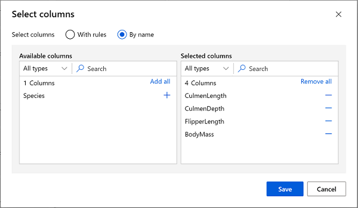
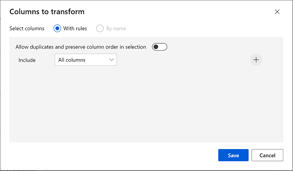

---
lab:
  title: Изучение кластеризации с помощью конструктора Машинного обучения Azure
---

# Изучение кластеризации с помощью конструктора Машинного обучения Azure

> **Примечание**. Для выполнения этого задания вам потребуется [подписка Azure](https://azure.microsoft.com/free?azure-portal=true), в которой у вас есть административный доступ.

## Создание рабочей области машинного обучения Azure  

1. Войдите на [портал Microsoft Azure](https://portal.azure.com?azure-portal=true) с помощью учетной записи Майкрософт.

1. Нажмите **+ Создать ресурс**, выполните поиск по строке *Машинное обучение* и создайте ресурс **Машинное обучение Azure** с планом *Машинное обучение Azure*. Используйте следующие параметры:
    - **Подписка**: *ваша подписка Azure*.
    - **Группа ресурсов**: *создайте или выберите группу ресурсов*.
    - **Имя рабочей области**: *введите уникальное имя для рабочей области*.
    - **Регион**: *выберите ближайший к вам географический регион*.
    - **Учетная запись хранения**: *обратите внимание на новую учетную запись хранения по умолчанию, которая будет создана для рабочей области*.
    - **Хранилище ключей**: *обратите внимание на новое хранилище ключей по умолчанию, которое будет создано для рабочей области*.
    - **Application Insights**: *обратите внимание на новый ресурс Application Insights по умолчанию, который будет создан для рабочей области*.
    - **Реестр контейнеров**: нет (*один будет создан автоматически при первом развертывании модели в контейнере*)

1. Выберите **Проверить и создать**, а затем выберите **Создать**. Дождитесь создания рабочей области (это может занять несколько минут), а затем перейдите к развернутому ресурсу.

1. Выберите **Запустить Студию** (или откройте новую вкладку браузера и перейдите по адресу [https://ml.azure.com](https://ml.azure.com?azure-portal=true)), а затем войдите в Студию машинного обучения Azure, используя свою учетную запись Майкрософт.

1. В Студии машинного обучения Azure вы увидите только что созданную рабочую область. Если это не так, выберите каталог Azure в меню слева. Затем в новом меню слева выберите **Рабочие области**. Здесь будут перечислены все рабочие области, связанные с вашей подпиской, выберите ту, которую вы создали для этого упражнения.

> **Примечание** В этом модуле, как и в многих других, в том числе в других модулях схемы обучения [Основы ИИ Microsoft Azure. Обзор визуальных средств для машинного обучения](https://docs.microsoft.com/learn/paths/create-no-code-predictive-models-azure-machine-learning/) используется рабочая область Машинного обучения Azure. Если вы используете собственную подписку Azure, можно создать рабочую область и повторно использовать ее в других модулях. В вашей подписке Azure будет начисляться небольшая плата за хранение данных, так как в ней существует рабочая область Машинного обучения Azure. Поэтому мы рекомендуем удалить рабочую область Машинного обучения Azure, когда она будет не нужна.

## Создание вычислений

1. В [Студии машинного обучения Azure](https://ml.azure.com?azure-portal=true) выберите значок **≡** (значок меню в виде столбика из трех линий) в левом верхнем углу для просмотра различных страниц в интерфейсе. Возможно, потребуется увеличить размер экрана. Страницы на панели слева можно использовать для управления ресурсами в рабочей области. Перейдите на страницу **Вычисления** (в разделе **Управление**).

2. На странице **Вычисления** выберите вкладку **Вычислительные кластеры** и добавьте новый вычислительный кластер с указанными ниже параметрами. Он будет использоваться для обучения модели машинного обучения.
    - **Расположение**: *выберите то же, что для рабочей области. Если этого расположения нет в списке, выберите ближайшее к вам*.
    - **Уровень виртуальной машины**: Выделенный.
    - **Тип виртуальной машины**: ЦП
    - **Размер виртуальной машины**:
        - Щелкните **Выбрать из всех параметров**
        - Найдите и выберите **Standard_DS11_v2**
    - Выберите **Далее**
    - **Имя вычисления**: *введите уникальное имя*.
    - **Минимальное число узлов**: 0
    - **Максимальное число узлов**: 2
    - **Время до уменьшения масштаба (сек)**: 120
    - **Включить доступ по SSH**: пусто
    - Нажмите кнопку **Создать**

> **Примечание** Вычислительные экземпляры и кластеры создаются на основе стандартных образов виртуальных машин Azure. При работе с этим модулем рекомендуется использовать образ *Standard_DS11_v2*, чтобы достичь оптимального соотношения стоимости и производительности. Если ваша подписка имеет квоту, которая не включает этот образ, выберите другой образ. Но имейте в виду, что использование образа большего размера может увеличить затраты, а образа меньшего размера может быть недостаточно для выполнения этих задач. Либо вы можете попросить администратора Azure увеличить квоту.

Создание кластера вычислений займет некоторое время. В это время можно перейти к следующему шагу.

## Создание конвейера и добавление набора данных

Чтобы приступить к работе с конструктором машинного обучения Azure, сначала необходимо создать конвейер.

1. В [Студии машинного обучения Azure](https://ml.azure.com?azure-portal=true) разверните левую панель, нажав на значок меню в левом верхнем углу экрана. Откройте страницу **Конструктор** (раздел **Разработка**), нажмите **+** и создайте новый конвейер.

1. Измените имя черновика (**Pipeline-Created-on-* date***) на **Train Penguin Clustering**.

    В машинном обучении Azure данные для обучения модели и других операций обычно инкапсулируются в объект, называемый *набором данных*. В этом модуле вы будете использовать набор данных, который включает наблюдение за тремя видами пингвинов.

1. Перейдите на страницу **Данные** (в разделе **Активы**). Эта страница содержит определенные файлы или таблицы, с которыми вы планируете работать в Машинном обучении Azure.

1. На странице **Данные** на вкладке **Ресурсы данных** нажмите **+ Создать**. Затем настройте указанные ниже параметры для ресурса данных.
    - **Тип данных**:
        - **Имя**: penguin-data
        - **Описание**: Данные о пингвинах
        - **Тип набора данных**: Табличный
    - **Источник данных**: из веб-файлов
    - **URL-адрес веб-сайта**:
        - **URL веб-узла**: https://aka.ms/penguin-data
        - **Пропустить проверку данных**: *не выбирайте*.
    - **Параметры**:
        - **Формат файла**: С разделителями
        - **Разделитель**: Запятая
        - **Кодировка**: UTF-8
        - **Заголовки столбцов**: заголовки содержит только первый файл.
        - **Пропуск строк**: Нет
        - **Набор данных содержит несколько строк**: *не выбирайте этот параметр*.
    - **Схема**:
        - включить все столбцы, кроме столбца **Путь**
        - Проверка автоматически обнаруженных типов
    - **Отзыв**
        - Нажмите кнопку **Создать**

1. Откройте созданный набор данных и просмотрите страницу **Обзор**, где отображается выборка данных. Эти данные представляют собой измерения длины и глубины надклювья, длины ласт и массы тела в нескольких наблюдениях за пингвинами. Существует три вида пингвинов, представленных в наборе данных: *Адели*, *субантарктические* и *антарктические*.

> **Примечание**. Набор данных по пингвинам, используемый в этом упражнении, представляет собой подмножество данных, который собран и предоставлен [доктором Кристен Горман](https://www.uaf.edu/cfos/people/faculty/detail/kristen-gorman.php) и [станцией "Палмер" в Антарктиде](https://pal.lternet.edu/), членом [сети долгосрочных экологических исследований](https://lternet.edu/).

### Загрузка данных на холст

1. Вернитесь к конвейеру, выбрав **Конструктор** в меню слева. На странице **Конструктор** выберите черновик конвейера **Train Penguin Clustering**.

1. Рядом с именем конвейера слева щелкните значок стрелок, чтобы развернуть панель, если она еще не развернута. Панель должна открываться по умолчанию в области **Библиотека ресурсов**, обозначенной значком книг в верхней части панели. Обратите внимание, что для поиска ресурсов доступна панель поиска. Обратите внимание на две кнопки: **Данные** и **Компонент**.

    

1. Выберите **Данные**, найдите и поместите набор данных **penguin-data** на холст.

1. Щелкните правой кнопкой мыши (CTRL+щелчок на компьютере Mac) набор данных **penguin-data** на холсте, а затем щелкните **Предварительный просмотр данных**.

1. Выберите вкладку *Профиль* и обратите внимание, что распределения различных столбцов отображаются как гистограммы.

1. Обратите внимание на следующие характеристики набора данных:

    - Этот набор данных содержит следующие столбцы.
        - **CulmenLength**: Длина надклювья пингвина в миллиметрах.
        - **CulmenDepth**: Глубина надклювья пингвина в миллиметрах.
        - **FlipperLength**: Длина ласт пингвина в миллиметрах.
        - **BodyMass**: Вес пингвина в граммах.
        - **Вид**: показатель вида (0: "Адели", 1: "Субантарктический", 2: "Антарктический")
    - В столбце **CulmenLengtр** отсутствуют два значения (в столбцах **CulmenDepth**, **FlipperLength** и **BodyMass** тоже отсутствуют два значения).
    - Значения измерений имеют различный масштаб (от десятых долей миллиметра до тысячных долей грамма).

1. Закройте страницу **Вывод данных**, чтобы отобразить набор данных на холсте конвейера.

## Применение преобразований

1. На панели **Библиотека ресурсов** слева щелкните **Компонент** (который содержит множество модулей, которые можно использовать для преобразования данных и обучения модели). Можно также использовать панель поиска для быстрого поиска модулей.

    

1. Для кластеризации наблюдений за пингвинами мы будем использовать только измерения. Таким образом, столбец "Вид" будет игнорироваться. Найдите модуль **Выбор столбцов в наборе данных** и поместите его на холст ниже модуля **penguin-data**, после чего подключите область выходных данных в нижней части модуля **penguin-data** к области входных данных в верхней части модуля **Выбор столбцов в наборе данных** следующим образом:

    

1. Дважды щелкните модуль **Выбор столбцов в наборе данных**, а затем на панели справа выберите **Изменить столбец**. Затем в окне **Выбор столбцов** выберите **По имени** и используйте ссылки **+** для выбора имен столбцов **CulmenLength**, **CulmenDepth**, **FlipperLength** и **BodyMass** следующим образом:

    

1. Нажмите **Сохранить**, затем закройте меню **Выбор столбцов в наборе данных**, чтобы вернуться на холст конструктора.

1. В **библиотеке ресурсов** найдите модуль **Очистка отсутствующих данных** и перетащите его на холст ниже модуля **Выбор столбцов в наборе данных**, а затем подключите их следующим образом:

    

1. Дважды щелкните модуль **Очистка отсутствующих данных** и нажмите **Изменить столбец** в области параметров справа. Затем в окне **Столбцы для очистки** выберите **С правилами** и добавьте **Все столбцы** следующим образом:

    

1. Нажмите кнопку **Сохранить** , а затем в области параметров задайте следующие параметры конфигурации:
    - **Минимальная доля отсутствующих значений**: 0.0
    - **Максимальная доля отсутствующих значений**: 1.0
    - **Режим очистки**: Удаление целой строки

1. В **библиотеке ресурсов** найдите модуль **Нормализация данных** и поместите его на холст ниже модуля **Очистка отсутствующих данных**. Затем подключите крайнюю слева область выходных данных модуля **Очистка отсутствующих данных** к области входных данных модуля **Нормализация данных**.

    

1. Дважды щелкните модуль **Нормализация данных** и на панели справа задайте для параметра **Метод преобразования** значение **MinMax**, после чего выберите **Изменить столбец**. Затем в окне **Столбцы для преобразования** выберите **С правилами** и добавьте **Все столбцы** следующим образом:

    

1. Нажмите **Сохранить** ,затем закройте параметры модуля **Нормализация данных**, чтобы вернуться на холст конструктора.

## Запуск конвейера

Чтобы применить преобразования данных, необходимо запустить конвейер как эксперимент.

1. Нажмите кнопку **Настроить и Отправить** в верхней части страницы, чтобы открыть диалоговое окно **Настройка задания конвейера**.

1. На странице **Основы** выберите **Создать** и задайте имя эксперимента **mslearn-penguin-training**, а затем нажмите кнопку **Далее**.

1. На странице **Входные и выходные данные** нажмите **Далее** без внесения изменений.

1. На странице **Параметры среды выполнения** появится ошибка, так как для запуска конвейера нет вычислительных ресурсов по умолчанию. В раскрывающемся списке **Выбор типа вычислений** выберите *Вычислительный кластер* и в раскрывающемся списке **Выбор вычислительного кластера машинного обучения Azure** выберите недавно созданный вычислительный кластер.

1. Нажмите кнопку **Далее**, чтобы просмотреть задание конвейера, а затем нажмите **Отправить**, чтобы запустить конвейер обучения.

1. Дождитесь завершения задания. Это может занять 5 минут или больше. Вы можете проверить состояние задания, выбрав **Задания** в разделе **Активы**. Здесь выберите задание **Train Penguin Clustering**.


## Просмотр преобразованных данных

1. По завершении выполнения операции модули будут выглядеть следующим образом:

    

1. Щелкните правой кнопкой мыши модуль **Нормализация данных**, выберите **Предварительный просмотр данных**, а затем нажмите **Преобразованный набор данных**, чтобы просмотреть результаты.

1. Просмотрите данные и обратите внимание, что столбец **Вид** удален, в нем нет отсутствующих значений, а значения всех четырех компонентов нормализованы и приведены к единому масштабу.

1. Закройте страницу  **Transformed_dataset**, чтобы вернуться к выполнению конвейера.

После выбора и подготовки функций, компонентов, которые планируется использовать из набора данных, можно использовать их для обучения модели кластеризации.

После подготовки данных с помощью преобразований эти данные можно использовать для обучения модели машинного обучения.

## Добавление модулей обучения

Выполните описанные ниже действия, чтобы расширить конвейер **Обучение модели кластеризации данных о пингвинах**, как показано ниже:


Следуйте приведенным ниже инструкциям, используя рисунок выше в качестве справки по добавлению и настройке необходимых модулей.

1. Вернитесь на страницу **Конструктора** и откройте черновик конвейера **Train Penguin Clustering**.

1. На панели **Библиотека ресурсов** слева найдите и поместите модуль **Разделение данных** на холст под модуль **Нормализация данных**. Затем подключите левую область выходных данных модуля **Нормализация данных** к области входных данных модуля **Разделение данных**.

    >**Совет** Используйте панель поиска, чтобы быстро находить модули.

1. Выберите модуль **Разделение данных** и настройте его параметры следующим образом.
    - **Режим разделения**: Разделение строк
    - **Доля строк в первом наборе выходных данных**: 0.7
    - **Случайное разделение**: да
    - **Случайное начальное значение**: 123
    - **Стратифицированное разделение**: Неверно

1. В **Библиотеке ресурсов** найдите и поместите модуль **Обучение модели кластеризации** на холст под модуль **Разделение данных**. Затем подключите область выходных данных *Результирующий набор данных1* (слева) модуля **Разделение данных** к области входных данных *Набор данных* (справа) модуля **Обучение модели кластеризации**.

1. Модель кластеризации должна назначать кластеры элементам данных, используя все компоненты, выбранные из исходного набора данных. Дважды щелкните модуль **Обучение модели кластеризации** и на панели справа выберите **Изменить столбцы**. Чтобы включить все столбцы, воспользуйтесь параметром **С правилами**, как показано ниже:

    

1. Модель, для которой выполняется обучение, будет использовать компоненты для группирования данных в кластеры, поэтому нам нужно обучить модель с помощью алгоритма *кластеризации*. В **Библиотеке ресурсов** найдите и поместите модуль **Кластеризация K-средних** на холст слева от модуля **Разделение данных** и над модулем **Обучение модели кластеризации**. После этого подключите область его выходных данных к области входных данных **Необученная модель** (слева) модуля **Модель кластеризации**.

1. Алгоритм *K-средние* группирует элементы в заданное число кластеров — это значение называется ***K***. Выберите модуль **Кластеризация K-средних** и на панели справа задайте для параметра **Число центроидов** значение **3**.

    > **Примечание**. Можно рассматривать наблюдения данных, например измерения пингвина, как многомерные векторы. Алгоритм K-средних работает следующим образом:
    > 1. он инициализирует *K*-координаты как произвольно выбранные точки, которые называются *центроидами*, в *n*-мерном пространстве (где *n* — число измерений в векторах компонентов).
    > 2. Отображение векторов компонентов в виде точек в одном пространстве и назначение каждой точки ближайшему центроиду.
    > 3. Перемещение центроидов в центр точек, выделенных для них (с учетом *среднего* расстояния).
    > 4. Переназначение точек ближайшему для них центроиду после перемещения.
    > 5. Повторяйте шаги с. и d. до тех пор, пока не будут стабилизированы выделения кластера или не будет выполнено указанное число итераций.

   После использования 70 % данных для обучения модели кластеризации можно использовать оставшиеся 30 % для тестирования с применением модели для назначения данных кластерам.

1. В **Библиотеке ресурсов** найдите и поместите модуль **Назначение данных кластерам** на холст под модуль **Обучение модели кластеризации**. Затем подключите область выходных данных **Обученная модель** (слева) модуля **Модель обучения кластеризации** к области входных данных **Обученная модель** (слева) модуля **Назначение данных кластерам** и подключите область выходных данных **Результирующий набор данных2** (справа) модуля **Разделение данных** к области входных данных **Набор данных** (справа) модуля **Назначение данных кластерам**.

## Запуск конвейера обучения

Теперь все готово для запуска конвейера обучения и процесса обучения модели.

1. Убедитесь, что конвейер выглядит следующим образом:

    

1. Выберите **Настроить и Отправить** и запустите конвейер, используя существующий эксперимент с именем **mslearn-penguin-training** в вашем вычислительном кластере.

1. Дождитесь завершения задания. Это может занять 5 минут или больше. Проверьте состояние задания, выбрав **Задания** в разделе **Ресурсы**. Здесь выберите последнее задание **Train Penguin Clustering**.

1. После завершения эксперимента щелкните правой кнопкой мыши модуль **Назначение данных кластерам** и выберите **Предварительный просмотр данных**, а затем нажмите **Результирующий набор данных**, чтобы просмотреть результаты.

1. Прокрутите вниз и обратите внимание на столбец **Назначения**, содержащий кластер (0, 1 или 2), которому назначена каждая из строк. Кроме того, есть новые столбцы, которые указывают расстояние от точки, представляющей эту строку, до центров каждого из кластеров — точка назначается кластеру, по отношению к которому она является ближайшей.

1. Закройте визуализацию **Results_dataset** , чтобы вернуться к выполнению конвейера.

Модель прогнозирует кластеры данных наблюдений за пингвинами, однако насколько надежны ее прогнозы? Чтобы оценить их надежность, необходимо проанализировать модель.

Анализ модели кластеризации осложняется тем, что не существует заранее известных значений *true* для назначений кластеров. Модель кластеризации считается успешной, если обеспечивает отделение элементов друг от друга на хорошем уровне в каждом кластере, поэтому нам потребуются метрики, которые помогут измерить уровень такого разделения.

## Добавление модуля "Анализ модели"

1. На странице **Конструктор** откройте черновик конвейера **Train Penguin Clustering**.

1. В **Библиотеке ресурсов** найдите и поместите модуль **Оценка модели** на холст под модулем **Назначение данных кластерам**. Подключите выходные данные модуля **Назначение данных кластерам** к входным данным **Набор данных для оценки** (слева) модуля **Оценка модели**.

1. Убедитесь, что конвейер выглядит следующим образом:

    

1. Выберите **Настроить и Отправить** и запустите конвейер, используя существующий эксперимент с именем **mslearn-penguin-training** в вашем вычислительном кластере.

1. Дождитесь завершения эксперимента. Чтобы проверить его состояние, перейдите на страницу **Задания** и выберите последнее задание **Train Penguin Clustering**.

1. Щелкните модуль **Оценка модели** правой кнопкой мыши и выберите **Предварительный просмотр данных**, а затем выберите **Результаты оценки**. В каждой строке изучите следующие метрики:
    - **Среднее расстояние до другого центра**
    - **Среднее расстояние до центра кластера**
    - **Число точек**
    - **Максимальное расстояние до центра кластера**

1. Закройте вкладку **Evaluation_results**.

Теперь можно использовать рабочую модель кластеризации для назначения новых данных кластерам в *конвейере вывода*.

После создания и запуска конвейера для обучения модели кластеризации можно создать *конвейер вывода*. Конвейер вывода использует модель для назначения кластерам новых данных по наблюдениям. Эта модель станет основой для прогнозной службы, которую можно опубликовать для использования в приложениях.

## Создание конвейера вывода

1. Найдите меню над холстом и выберите **Создать конвейер вывода**. Возможно, потребуется развернуть экран в полноэкранный режим и щелкнуть значок **...** в правом верхнем углу экрана, чтобы найти команду **Создать конвейер вывода** в меню.  

    

1. В раскрывающемся списке **Создание конвейера вывода** выберите **Конвейер вывода в режиме реального времени**. Через несколько секунд откроется новая версия конвейера с именем **Обучение модели кластеризации данных о пингвинах — вывод в реальном времени**.

1. Переименуйте новый конвейер в **Прогнозирование кластеров данных о пингвинах**, а затем проверьте новый конвейер. Преобразования и модель кластеризации в конвейере обучения являются частью этого конвейера. Обученная модель будет использоваться для оценки новых данных. Конвейер также содержит выходные данные веб-службы для возврата результатов.

    Вы собираетесь внести следующие изменения в конвейер вывода:

    

    - Добавьте компонент **входных данных веб-службы** для отправки новых данных.
    - Замените набор данных **penguin-data** на компонент **Ввод данных вручную**, не содержащий столбец **Вид**.
    - Удалите модуль **Выбор столбцов в наборе данных**, который на данный момент является лишним.
    - Соедините компоненты **Входные данные веб-службы** и **Ввод данных вручную** (которые представляют входные данные для кластеризуемых данных) к первому компоненту **Применение преобразования**.

    Выполните оставшиеся действия, указанные ниже, используя изображение и приведенные выше сведения в качестве справочных материалов на этапе изменения конвейера.

1. Конвейер не включает автоматически компонент **входных данных веб-службы** для моделей, созданных на основе пользовательских наборов данных. Найдите компонент **входных данных веб-службы** в библиотеке ресурсов и поместите его в начало конвейера.  Соедините выходные данные компонента **Входных данных веб-службы** с входными данными *Набор данных* (справа) первого компонента **Применение преобразований**, который уже есть на холсте.  

1. При использовании конвейера вывода предполагается, что новые данные соответствуют схеме исходных данных обучения, то есть набор данных **penguin-data** из конвейера обучения включен. Однако эти входные данные включают столбец данных по видам пингвинов, который не используется в модели. Удалите набор данных **penguin-data** и модули **Выбор столбцов в наборе данных** и замените их модулем **Ввод данных вручную** из **Библиотеки ресурсов**.

1. Затем измените параметры модуля **Ввод данных вручную**, чтобы использовать следующие входные данные в формате CSV, которые содержат значения компонентов для трех новых наблюдений за пингвинами (включая заголовки).

    ```CSV
    CulmenLength,CulmenDepth,FlipperLength,BodyMass
    39.1,18.7,181,3750
    49.1,14.8,220,5150
    46.6,17.8,193,3800
    ```

1. Соедините выходные данные модуля **Ввод данных вручную** с входными данными *Набор данных* (справа) первого модуля **Применение преобразования**.

1. Добавление модуля **Анализ модели**.

1. Убедитесь, что конвейер выглядит примерно следующим образом:

    

1. Отправьте конвейер как новый эксперимент с именем **mslearn-penguin-inference** в вычислительном кластере. Выполнение эксперимента может занять некоторое время.

1. Перейдите к **Заданиям** и выберите последнее задание **Прогнозирование кластеров данных о пингвинах** с именем эксперимента **mslearn-penguin-inference** .

1. После завершения конвейера правой кнопкой мыши щелкните модуль **Назначение данных кластерам**, выберите **Предварительный просмотр данных**, а затем выберите **Результирующий набор данных**, чтобы просмотреть спрогнозированные назначения кластеров и метрики для трех наблюдений за пингвинами во входных данных.

Ваш конвейер вывода назначает наблюдения о пингвинах кластерам с учетом их компонентов. Теперь все готово для публикации конвейера и его дальнейшего использования клиентскими приложениями.

## Развертывание службы

В этом упражнении вы развернете веб-службу в Экземпляре контейнера Azure (ACI). Этот тип вычислений создается динамически и он полезен для разработки и тестирования. В рабочей среде следует создать *кластер вывода*, который предоставляет кластер Azure Kubernetes Service (AKS), обеспечивающий лучшую масштабируемость и безопасность.

1. На странице выполнения вывода **Прогнозирование кластеров данных о пингвинах** выберите **Развернуть** в верхней строке меню.

    

1. Нажмите **Развернуть новую конечную точку в реальном времени** и используйте следующие параметры:
    - **Имя**: predict-penguin-clusters
    - **Описание**: Кластер пингвинов.
    - **Тип вычислений**: Экземпляр контейнера Azure

1. Дождитесь развертывания веб-службы. Это может занять несколько минут. 

1. Для просмотра состояния развертывания разверните левую панель, нажав значок меню в левом верхнем углу экрана. Просмотрите страницу **Конечные точки** (в разделе **Ресурсы**) и выберите **predict-penguin-clusters**. По завершении развертывания **состояние развертывания** изменится на **работоспособно**.

## Тестирование службы

1. На странице **Конечные точки** откройте конечную точку в реальном времени **predict-penguin-clusters** и выберите вкладку **Тест**.

    

1. Мы будем использовать ее для тестирования модели с новыми данными. Удалите текущие данные из раздела **входных данных для тестирования конечной точки для прогнозирования в реальном времени**. Скопируйте и вставьте в раздел данных приведенные ниже данные:

    ```JSON
    {
        "Inputs": {
            "input1": [
                {
                    "CulmenLength": 49.1,
                    "CulmenDepth": 4.8,
                    "FlipperLength": 1220,
                    "BodyMass": 5150
                }
            ]
        },
        "GlobalParameters":  {}
    }
    ```

    > **Примечание**. JSON, представленный выше, определяет признаки пингвинов и использует созданную вами службу **predict-penguin-clusters** для прогнозирования назначения кластера.

1. Выберите **Тест**. В правой части экрана должны отобразиться выходные данные **Assignments**. Обратите внимание, что назначенный кластер находится ближе всего к центру кластеров.

    

Вы протестировали службу, и теперь ее можно подключить к клиентскому приложению с помощью учетных данных на вкладке **Использование**. На этом задание завершено. Вы можете продолжить эксперимент с только что развернутой службой.

## Очистка

Созданная веб-служба размещается в *экземпляре контейнера Azure*. Если вы не планируете экспериментировать с ним и дальше, следует удалить конечную точку, чтобы избежать лишнего использования ресурсов Azure. Кроме того, следует удалить вычислительный кластер.

1. В [студии машинного обучения Azure](https://ml.azure.com?azure-portal=true) на вкладке **Конечные точки** выберите конечную точку **predict-penguin-clusters**. Затем выберите **Удалить** (&#128465;) и подтвердите удаление конечной точки.

1. На странице **Вычисления** (вкладка **Вычислительные кластеры**) выберите вычислительный кластер и нажмите **Удалить**.

>**Примечание** Удаление вычислений гарантирует, что в вашей подписке не будет начисляться плата за вычислительные ресурсы. Однако с вас будет взиматься небольшая плата за хранение данных, так как в вашей подписке существует рабочая область Машинного обучения Azure. Если вы завершили изучение возможностей Машинного обучения Azure, можно удалить рабочую область Машинного обучения Azure и связанные с ней ресурсы. Но если вы планируете выполнять другие задания из этой серии, вам нужно будет создать рабочую область повторно.
>
> Чтобы удалить рабочую область:
>
> 1. На [портале Microsoft Azure](https://portal.azure.com?azure-portal=true) (страница **Группы ресурсов**) откройте группу ресурсов, указанную при создании рабочей области машинного обучения Azure.
> 1. Щелкните **Удалить группу ресурсов**, введите имя группы ресурсов, чтобы подтвердить ее удаление, и выберите **Удалить**.
