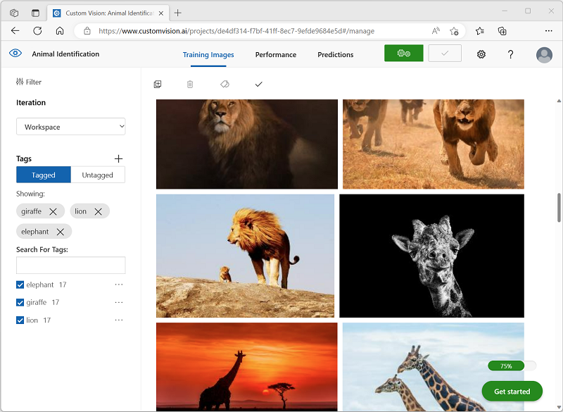

---
lab:
  title: Изучение классификации изображений
---

# Изучение классификации изображений

Служба *Зрение ИИ Azure * предоставляет полезные готовые модели для обработки изображений, но для использования возможностей компьютерного зрения вам часто потребуется обучать собственную модель. Например, предположим, что организация по охране дикой природы хочет отслеживать появление животных с помощью камер, реагирующих на движение. Затем изображения, снятые камерами, могут использоваться для проверки присутствия конкретных видов в определенной области и оказания помощи в сохранении видов, находящихся под угрозой исчезновения. Для этого организация может воспользоваться моделью *классификации изображений*, которая обучена определять различные виды животных на отснятых фотографиях.

В Azure можно использовать службу ***Пользовательского визуального распознавания*** для обучения модели классификации изображений на основе существующих изображений. Есть два момента, которые нужно учитывать при создании решения для классификации изображений. Во-первых, вы должны обучить модель распознавать разные классы с использованием существующих изображений. Затем, когда модель обучена, ее необходимо опубликовать как службу, которая может использоваться приложениями.

Чтобы протестировать возможности службы "Компьютерное зрение", мы используем простое приложение командной строки, которое выполняется в Cloud Shell. Те же принципы и функциональные возможности реализованы и в реальных решениях, таких как веб-сайты и мобильные приложения.

## Перед началом работы

Для выполнения этого задания вам потребуется [подписка Azure](https://azure.microsoft.com/free?azure-portal=true), в которой у вас есть административный доступ.

## Создание ресурса *Служб ИИ Azure*

Для работы со службой "Пользовательское визуальное распознавание" можно создать ресурс **Пользовательского визуального распознавания** или **Служб ИИ Azure**.

>**Примечание** Некоторые ресурсы недоступны в некоторых регионах. При создании как ресурса Пользовательского визуального распознавания, так и ресурса служб ИИ Azure для доступа к службам Пользовательского визуального распознавания можно использовать только ресурсы, созданные в [определенных регионах](https://azure.microsoft.com/global-infrastructure/services/?products=cognitive-services). Для удобства в инструкциях по конфигурации ниже регион выбран заранее.

Создайте ресурс **служб ИИ Azure** в подписке Azure.

1. Откройте портал Azure по адресу [https://portal.azure.com](https://portal.azure.com?azure-portal=true) и войдите в него, используя свою учетную запись Майкрософт.

1. Щелкните кнопку **＋Создать ресурс** и найдите *Службы ИИ Azure*. Выберите **создать** план**Службы ИИ Azure**. Вы перейдете на страницу, чтобы создать ресурс служб ИИ Azure. Настройте, используя следующие параметры:
    - **Подписка**: *ваша подписка Azure*.
    - **Группа ресурсов**: *выберите существующую или создайте новую группу ресурсов с уникальным именем*.
    - **Регион:** восточная часть США.
    - **Имя**: *укажите уникальное имя*.
    - **Ценовая категория**: Стандартный S0.
    - **Устанавливая этот флажок, я подтверждаю, что мною прочитаны все приведенные ниже условия и я понимаю их**: флажок установлен.

1. Проверьте и создайте ресурс, а затем дождитесь завершения развертывания. Затем перейдите к развернутому ресурсу.

1. Откройте страницу **Ключи и конечная точка** для своего ресурса службы ИИ Azure. Для подключения из клиентских приложений потребуются конечная точка и ключи.

## Создание проекта в службе "Пользовательское визуальное распознавание"

Чтобы обучить модель обнаружения объектов, необходимо создать проект Пользовательского визуального распознавания на основе учебного ресурса. Для этого воспользуйтесь порталом Пользовательского визуального распознавания.

1. Скачайте и извлеките обучающие изображения отсюда: [https://aka.ms/animal-images](https://aka.ms/animal-images). Эти изображения предоставляются в заархивированной папке (файл ZIP), которая содержит вложенные папки с именем **elephant**, **giraffe** и **lion**.

1. Откройте новую вкладку браузера и перейдите на портал Пользовательское визуальное распознавание на [https://customvision.ai](https://customvision.ai?azure-portal=true). При появлении запроса войдите в систему, используя учетную запись Майкрософт, связанную с вашей подпиской Azure, и примите условия службы.

1. На портале Пользовательского визуального распознавания создайте новый проект со следующими параметрами:

    - **Имя**: Идентификация животных
    - **Описание**: Классификация изображений животных
    - **Ресурс**: *Созданный ранее ресурс Пользовательского визуального распознавания или служб ИИ Azure*
    - **Типы проектов**: Классификация
    - **Типы классификации**: по нескольким классам (один тег на изображение)
    - **Домены**: Общий \[A2]

1. Нажмите **Добавить изображения** и выберите все файлы в папке **elephant**, которые были распакованы ранее. Затем загрузите файлы изображений, указав тег *elephant* следующим образом:

    

1. Нажмите кнопку **Добавить изображения** ([+]), чтобы отправить изображения в папку **giraffe** с тегом *giraffe*и изображения в папку **lion** с тегом *lion*.

1. Просмотрите изображения, загруженные в проект Пользовательского визуального распознавания. Там должно быть 17 изображений каждого класса, например:

    

1. В проекте Пользовательского визуального распознавания щелкните **Обучить** над изображениями, чтобы обучить модель классификации с использованием изображений с тегами. Выберите вариант **Быстрое обучение** и дождитесь завершения итерации обучения.

    > **Совет**: Обучение может занять несколько минут. Пока вы ждете, проверьте [Как селфи снежного барса и ИИ могут помочь спасти виды от вымирания](https://news.microsoft.com/transform/snow-leopard-selfies-ai-save-species/), что описывает реальный проект, который использует компьютерное зрение для отслеживания находящихся под угрозой исчезновения животных в дикой природе.

1. При обучении итерации модели изучите метрики производительности *Точность*, *Полнота* и *Средняя точность*, которые характеризуют точность прогнозирования для модели классификации и все должны иметь высокие значения.

## Тестирование модели

Перед публикацией этой итерации модели для использования приложениями протестируйте ее.

1. Над метриками производительности щелкните **Быстрый тест**.

1. В поле **URL-адрес изображения** введите `https://aka.ms/giraffe` и нажмите кнопку **изображение быстрого теста (➔)**.

1. Просмотрите прогнозы, возвращенные моделью. Оценка вероятности для *giraffe* должна быть самой высокой, например:

    

1. Закройте окно **Быстрый тест**.

## Публикация модели классификации изображений

Теперь вы готовы опубликовать обученную модель и использовать ее из клиентского приложения.

1. Щелкните **&#128504; Опубликовать**, чтобы опубликовать обученную модель со следующими параметрами:
    - **Имя модели**: животные
    - **Ресурс прогнозирования**: *Службы ИИ Azure или ранее созданный вами ресурс прогнозирования Пользовательского визуального распознавания*.

1. После публикации щелкните *URL-адрес прогноза* (&#127760;), чтобы просмотреть сведения, необходимые для использования опубликованной модели.

    

Позже вам потребуются соответствующие значения URL-адреса и Prediction-Key, чтобы получить прогноз из URL-адреса изображения, поэтому оставьте это диалоговое окно открытым и переходите к следующей задаче.

## Добавить клиентское приложение

Чтобы протестировать возможности службы Пользовательского визуального распознавания, мы используем простое приложение командной строки, которое выполняется в Cloud Shell в Azure.

1. Вернитесь на вкладку браузера, содержащую портал Azure, и нажмите кнопку **Cloud shell** (**[>_]**) в верхней части страницы справа от поля поиска. В нижней части портала откроется панель Cloud Shell.

    При первом запуске Cloud Shell вам может быть предложено выбрать тип оболочки, которую вы будете использовать (*Bash* или *PowerShell*). Выберите **PowerShell**.

    Если вам будет предложено создать хранилище для Cloud Shell, укажите свою подписку и нажмите **Создать хранилище**. Затем подождите минуту, пока хранилище не будет создано.

    Когда Cloud Shell будет готова, она должна выглядеть следующим образом:
    
    

    > **Совет**: Убедитесь, что в левом верхнем углу панели Cloud Shell указан тип оболочки *PowerShell*. Если там указана оболочка *Bash*, выберите *PowerShell* из раскрывающегося меню.

    Обратите внимание, что можно изменить размер Cloud Shell, перетащив разделительную полосу в верхней части области или воспользовавшись значками **&#8212;**, **&#9723;** и **X** в правом верхнем углу области для ее свертывания, развертывания или закрытия. Дополнительные сведения об использовании Azure Cloud Shell см. в [документации по Azure Cloud Shell](https://docs.microsoft.com/azure/cloud-shell/overview).

2. В командной оболочке введите следующие команды, чтобы скачать файлы для этого упражнения и сохранить их в папке с именем **ai-900** (после удаления этой папки, если она уже существует)

    ```PowerShell
    rm -r ai-900 -f
    git clone https://github.com/MicrosoftLearning/AI-900-AIFundamentals ai-900
    ```

3. После скачивания файлов введите следующие команды, чтобы перейти в папку **ai-900** и изменить файл кода для этого упражнения:

    ```PowerShell
    cd ai-900
    code classify-image.ps1
    ```

    Обратите внимание, что откроется редактор, подобный показанному на изображении ниже:

     

     > **Совет**: Для изменения размера панелей можно использовать разделительную полосу между командной строкой Cloud Shell и редактором кода.

4. Не стоит волноваться по поводу содержимого кода. Важно, чтобы он начитался с какого-нибудь кода, чтобы указать URL-адрес прогнозирования и ключ для модели Пользовательское визуальное распознавание. Необходимо обновить их таким образом, чтобы остальная часть кода использовала вашу модель.

    Получите *URL-адрес прогнозирования* и *ключ прогнозирования* из диалогового окна, который вы оставили открытым на вкладке браузера для проекта Пользовательское визуальное распознавание. **Вам потребуется использовать версии,* если у вас есть URL-адрес изображения*.**

    Используйте эти значения, чтобы заменить заполнители **YOUR_PREDICTION_URL** и **YOUR_PREDICTION_KEY** в файле кода.

    Когда вы вставите значения URL-адреса и ключа прогнозирования, первые две строки кода должны выглядеть так:

    ```PowerShell
    $predictionUrl="https..."
    $predictionKey ="1a2b3c4d5e6f7g8h9i0j...."
    ```

5. После внесения изменений в переменные в коде нажмите клавиши **CTRL+S**, чтобы сохранить файл. Затем нажмите клавиши **CTRL+Q**, чтобы закрыть редактор кода.

## Проверка клиентского приложения

Теперь можно использовать пример клиентского приложения для классификации изображений на основе содержащегося в нем животного.

1. В области PowerShell введите следующую команду, чтобы выполнить код:

    ```PowerShell
    ./classify-image.ps1 1
    ```

    Этот код использует вашу модель для классификации следующего изображения:

    

1. Просмотрите прогноз, который должен иметь значение **giraffe**.

1. Теперь давайте попробуем еще одно изображение. Выполните следующую команду:

    ```PowerShell
    ./classify-image.ps1 2
    ```

    На этот раз следующее изображение классифицируется:

    

1. Убедитесь, что модель классифицирует это изображение как **elephant**.

1. Попробуем еще одно. Выполните следующую команду:

    ```PowerShell
    ./classify-image.ps1 3
    ```

    Последнее изображение выглядит следующим образом:

    

1. Убедитесь, что модель классифицирует это изображение как **lion**.

Надеюсь, ваша модель классификации изображений правильно классифицировала все три изображения.


