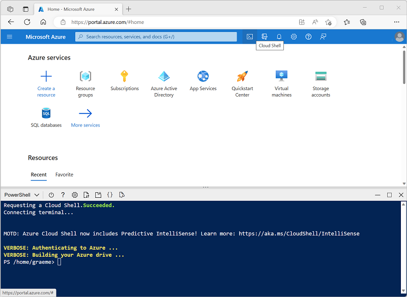

---
lab:
  title: Изучение классификации изображений
---

# Изучение классификации изображений

*Служба визуального распознавания* ИИ Azure предоставляет полезные готовые модели для работы с изображениями, но вам часто потребуется обучить собственную модель компьютерного зрения. Например, предположим, что организация по сохранению дикой природы хочет отслеживать наблюдения животных с помощью камер, чувствительных к движениям. Затем изображения, захваченные камерами, могут использоваться для проверки присутствия конкретных видов в определенной области и оказания помощи в сохранении видов, находящихся под угрозой исчезновения. Для этого организация может воспользоваться *моделью классификации* изображений, которая обучена определять различные виды животных на захваченных фотографиях.

В Azure можно использовать ***службу Пользовательское визуальное распознавание*** для обучения модели классификации изображений на основе существующих образов. Есть два момента, которые нужно учитывать при создании решения для классификации изображений. Во-первых, вы должны обучить модель распознавать разные классы с использованием существующих изображений. Затем, когда модель обучена, ее необходимо опубликовать как службу, которая может использоваться приложениями.

Чтобы протестировать возможности службы "Компьютерное зрение", мы используем простое приложение командной строки, которое выполняется в Cloud Shell. Те же принципы и функциональные возможности применяются в реальных решениях, таких как веб-сайты или мобильные приложения.

## Перед началом работы

Для выполнения этого задания вам потребуется [подписка Azure](https://azure.microsoft.com/free?azure-portal=true), в которой у вас есть административный доступ.

## *Создание ресурса служб* ИИ Azure

Службу Пользовательское визуальное распознавание можно использовать, создав либо ресурс Пользовательское визуальное распознавание **, **либо **ресурс служб** ИИ Azure.

>**Примечание** Некоторые ресурсы недоступны в некоторых регионах. Независимо от того, создаете Пользовательское визуальное распознавание или ресурс служб искусственного интеллекта Azure, для доступа к службам Пользовательское визуальное распознавание можно использовать только ресурсы, созданные в [определенных регионах](https://azure.microsoft.com/global-infrastructure/services/?products=cognitive-services). Для удобства в инструкциях по конфигурации ниже регион выбран заранее.

**Создайте ресурс служб** ИИ Azure в подписке Azure.

1. Откройте портал Azure по адресу [https://portal.azure.com](https://portal.azure.com?azure-portal=true) и войдите в него, используя свою учетную запись Майкрософт.

1. **Щелкните &65291; Создайте кнопку ресурса** и найдите *службы* ИИ Azure. Выберите **план** **служб** ИИ Azure. Вы перейдете на страницу, чтобы создать ресурс служб искусственного интеллекта Azure. Настройте его с помощью следующих параметров:
    - **Подписка**: *ваша подписка Azure*.
    - **Группа ресурсов**: *выберите существующую или создайте новую группу ресурсов с уникальным именем*.
    - **Регион:** восточная часть США.
    - **Имя**: *укажите уникальное имя*.
    - **Ценовая категория**: Стандартный S0.
    - **Устанавливая этот флажок, я подтверждаю, что мною прочитаны все приведенные ниже условия и я понимаю их**: флажок установлен.

1. Проверьте и создайте ресурс, а затем дождитесь завершения развертывания. Затем перейдите к развернутому ресурсу.

1. Просмотрите страницу "Ключи" и " **Конечная точка** " для ресурса служб искусственного интеллекта Azure. Для подключения из клиентских приложений потребуются конечная точка и ключи.

## Создание проекта в службе "Пользовательское визуальное распознавание"

Чтобы обучить модель обнаружения объектов, необходимо создать проект Пользовательского визуального распознавания на основе учебного ресурса. Для этого воспользуйтесь порталом Пользовательского визуального распознавания.

1. Скачайте и извлеките обучающие изображения отсюда: [https://aka.ms/animal-images](https://aka.ms/animal-images). Эти изображения предоставляются в архивной папке, которая при извлечении содержит вложенные папки, называемые **слоном**, **жирафом** и **львом**.

1. Откройте новую вкладку браузера и перейдите на портал Пользовательское визуальное распознавание на [https://customvision.ai](https://customvision.ai?azure-portal=true)сайте. При появлении запроса войдите в систему, используя учетную запись Майкрософт, связанную с вашей подпиской Azure, и примите условия службы.

1. На портале Пользовательского визуального распознавания создайте новый проект со следующими параметрами:

    - **Имя**: идентификация животных
    - **Описание**: классификация изображений для животных
    - **Ресурс**: *службы ИИ Azure или созданный ранее ресурс Пользовательское визуальное распознавание*
    - **Типы проектов**: классификация
    - **Типы классификации**: по нескольким классам (один тег на изображение)
    - **Домены**: Общие \[A2]

1. Нажмите кнопку **"Добавить изображения**" и выберите все файлы в папке **слона** , извлеченной ранее. Затем отправьте файлы изображений, указав слон* тега*, как показано ниже:

    

1. Нажмите кнопку **"Добавить изображения**([+]", чтобы отправить изображения в **папку giraffe с *тегом giraffe*** и изображения в **папке льва** с *львом*.

1. Изучите изображения, отправленные в проекте Пользовательское визуальное распознавание, используйте 17 изображений каждого класса, как показано ниже.

    

1. В проекте Пользовательского визуального распознавания щелкните **Обучить** над изображениями, чтобы обучить модель классификации с использованием изображений с тегами. **Выберите параметр быстрого обучения** и дождитесь завершения итерации обучения.

    > **Совет.** Обучение может занять несколько минут. Пока вы ждете, проверка, [как снежные леопарды селфи и ИИ могут помочь спасти виды от вымирания](https://news.microsoft.com/transform/snow-leopard-selfies-ai-save-species/), который описывает реальный проект, который использует компьютерное зрение для отслеживания находящихся под угрозой исчезновения животных в дикой природе.

1. При обучении итерации модели изучите метрики производительности *Точность*, *Полнота* и *Средняя точность*, которые характеризуют точность прогнозирования для модели классификации и все должны иметь высокие значения.

## Тестирование модели

Перед публикацией этой итерации модели для использования приложениями протестируйте ее.

1. Над метриками производительности щелкните **Быстрый тест**.

1. **В поле URL-адрес** изображения введите `https://aka.ms/giraffe` и нажмите кнопку **быстрого теста (&10132;).**

1. Просмотрите прогнозы, возвращаемые вашей моделью, — оценка вероятности для *жирафа* должна быть самой высокой, как показано ниже.

    

1. Закройте окно **Быстрый тест**.

## Публикация модели классификации изображений

Теперь вы готовы опубликовать обученную модель и использовать ее из клиентского приложения.

1. Щелкните **&#128504; Опубликовать**, чтобы опубликовать обученную модель со следующими параметрами:
    - **Имя** модели: животные
    - **Ресурс** прогнозирования: *службы ИИ Azure или созданный ранее* ресурс прогнозирования Пользовательское визуальное распознавание.

1. После публикации щелкните *URL-адрес прогноза* (&#127760;), чтобы просмотреть сведения, необходимые для использования опубликованной модели.

    

Позже вам потребуются соответствующие значения URL-адреса и Prediction-Key, чтобы получить прогноз из URL-адреса изображения, поэтому оставьте это диалоговое окно открытым и переходите к следующей задаче.

## Подготовка клиентского приложения

Чтобы проверить возможности службы Пользовательское визуальное распознавание, мы будем использовать простое приложение командной строки, которое выполняется в облачной оболочке в Azure.

1. Вернитесь на вкладку браузера, содержащую портал Azure, и нажмите **кнопку Cloud Shell** (**[>_]**) в верхней части страницы справа от поля поиска. Откроется панель cloud shell в нижней части портала.

    При первом запуске Cloud Shell вам может быть предложено выбрать тип оболочки, которую вы будете использовать (*Bash* или *PowerShell*). Если да, выберите **PowerShell**.

    Если вам будет предложено создать хранилище для Cloud Shell, убедитесь, что выбрана подписка и выберите команду **"Создать хранилище**". Затем подождите минуту, пока хранилище не будет создано.

    Когда облачная оболочка готова, она должна выглядеть следующим образом:
    
    

    > **Совет.** Убедитесь, что тип оболочки, указанной в левом верхнем углу панели Cloud Shell, — *PowerShell*. Если там указана оболочка *Bash*, выберите *PowerShell* из раскрывающегося меню.

    Обратите внимание, что можно изменить размер Cloud Shell, перетащив разделительную полосу в верхней части области или воспользовавшись значками **&#8212;**, **&#9723;** и **X** в правом верхнем углу области для ее свертывания, развертывания или закрытия. Дополнительные сведения об использовании Azure Cloud Shell см. в [документации по Azure Cloud Shell](https://docs.microsoft.com/azure/cloud-shell/overview).

2. В командной оболочке введите следующие команды, чтобы скачать файлы для этого упражнения и сохранить их в папке с именем **ai-900** (после удаления этой папки, если она уже существует)

    ```PowerShell
    rm -r ai-900 -f
    git clone https://github.com/MicrosoftLearning/AI-900-AIFundamentals ai-900
    ```

3. После скачивания файлов введите следующие команды, чтобы перейти в **каталог ai-900** и изменить файл кода для этого упражнения:

    ```PowerShell
    cd ai-900
    code classify-image.ps1
    ```

    Обратите внимание, что откроется редактор, как в рисунке ниже:

     

     > **Совет.** Для изменения размера панелей можно использовать панель разделителя между командной строкой Cloud Shell и редактором кода.

4. Не стоит волноваться по поводу содержимого кода. Важно, чтобы он начал с некоторого кода, чтобы указать URL-адрес прогнозирования и ключ для модели Пользовательское визуальное распознавание. Необходимо обновить их таким образом, чтобы остальная часть кода использовала модель.

    *Получите URL-адрес* прогнозирования и *ключ* прогнозирования из диалогового окна, который вы оставили открытым на вкладке браузера для проекта Пользовательское визуальное распознавание. **Вам потребуется использовать *версии, если у вас есть URL-адрес* образа.**

    Используйте эти значения, чтобы заменить **YOUR_PREDICTION_URL** и **YOUR_PREDICTION_KEY** поместить держателей в файл кода.

    Когда вы вставите значения URL-адреса и ключа прогнозирования, первые две строки кода должны выглядеть так:

    ```PowerShell
    $predictionUrl="https..."
    $predictionKey ="1a2b3c4d5e6f7g8h9i0j...."
    ```

5. После внесения изменений в переменные в коде нажмите клавиши **CTRL+S** , чтобы сохранить файл. Затем нажмите клавиши **CTRL+Q** , чтобы закрыть редактор кода.

## Проверка клиентского приложения

Теперь можно использовать пример клиентского приложения для классификации изображений на основе содержащегося в нем животного.

1. В области PowerShell введите следующую команду, чтобы выполнить код:

    ```PowerShell
    ./classify-image.ps1 1
    ```

    Этот код использует модель для классификации следующего образа:

    

1. Просмотрите прогноз, который должен быть **жирафом**.

1. Теперь давайте попробуем другой образ. Выполните следующую команду:

    ```PowerShell
    ./classify-image.ps1 2
    ```

    На этот раз следующий образ классифицируется:

    

1. Убедитесь, что модель классифицирует это изображение как **слон**.

1. Давайте попробуем еще один. Выполните следующую команду:

    ```PowerShell
    ./classify-image.ps1 3
    ```

    Окончательное изображение выглядит следующим образом:

    

1. Убедитесь, что модель классифицирует это изображение как **лев**.

Надеюсь, ваша модель классификации изображений правильно классифицировала все три изображения.


