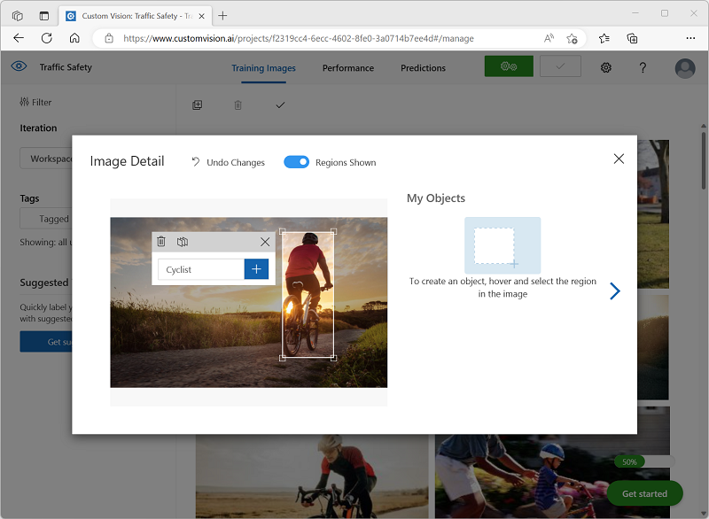
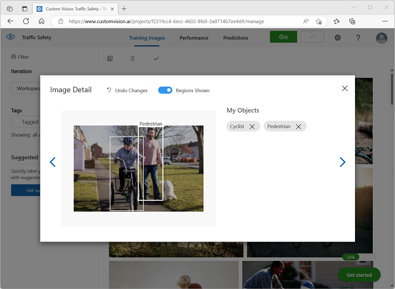

---
lab:
  title: Изучение обнаружения объектов
---

# Изучение обнаружения объектов

> **Примечание**. Для выполнения этого задания вам потребуется [подписка Azure](https://azure.microsoft.com/free?azure-portal=true), в которой у вас есть административный доступ.

*Обнаружение объектов* — это разновидность компьютерного зрения. Модель машинного обучения обучается классифицировать отдельные экземпляры объектов на изображении и указывает *ограничивающую рамку*, которая отмечает их расположение. Это можно представить, как расширенную форму *классификации изображений* (модель отвечает на вопрос о том, что это за изображение) для создания решений. Мы можем спросить модель о том, какие объекты есть на этом изображении и где они находятся.

Например, инициатива по обеспечению безопасности дорожного движения может определить пешеходов и велосипедистов как наиболее уязвимых участников дорожного движения на транспортных перекрестках. Используя камеры для наблюдения за перекрестками, можно анализировать изображения участников дорожного движения, чтобы обнаруживать пешеходов и велосипедистов, отслеживать их количество или даже изменять поведение светофоров.

Служба **Пользовательское визуальное распознавание** в Microsoft Azure предоставляет облачное решение для создания и публикации пользовательских моделей обнаружения объектов. В Azure можно использовать службу Пользовательского визуального распознавания для обучения модели обнаружения объектов на основе существующих изображений. Существует два элемента для создания решения для обнаружения объектов. Сначала необходимо обучить модель обнаруживать расположение и класс объектов с помощью помеченных изображений. Затем, когда модель обучена, ее необходимо опубликовать как службу, которая может использоваться приложениями.

Чтобы протестировать возможности службы Пользовательского визуального распознавания по обнаружению объектов в изображениях, мы будем использовать простое приложение командной строки, которое выполняется в Cloud Shell. Те же принципы и функциональные возможности реализованы и в реальных решениях, таких как веб-сайты и мобильные приложения.

## Создание ресурса *Служб ИИ Azure*

Для работы со службой "Пользовательское визуальное распознавание" можно создать ресурс **Пользовательского визуального распознавания** или **Служб ИИ Azure**.

> **Примечание** Некоторые ресурсы недоступны в некоторых регионах. При создании ресурса Пользовательского визуального распознавания или служб ИИ Azure, для доступа к службам Пользовательского визуального распознавания можно использовать только ресурсы, созданные в [определенных регионах](https://azure.microsoft.com/global-infrastructure/services/?products=cognitive-services). Для удобства в инструкциях по конфигурации ниже регион выбран заранее.

Создайте ресурс **служб ИИ Azure** в подписке Azure.

1. На другой вкладке браузера откройте портал Azure по адресу [https://portal.azure.com](https://portal.azure.com?azure-portal=true) и войдите в него, используя свою учетную запись Майкрософт.

1. Щелкните кнопку **＋Создать ресурс** и найдите *Службы ИИ Azure*. Выберите **создать** план**Службы ИИ Azure**. Вы перейдете на страницу, чтобы создать ресурс служб ИИ Azure. Настройте, используя следующие параметры:
    - **Подписка**: *ваша подписка Azure*.
    - **Группа ресурсов**: *выберите существующую или создайте новую группу ресурсов с уникальным именем*.
    - **Регион:** восточная часть США.
    - **Имя**: *укажите уникальное имя*.
    - **Ценовая категория**: Стандартный S0.
    - **Устанавливая этот флажок, я подтверждаю, что мною прочитаны все приведенные ниже условия и я понимаю их**: флажок установлен.

1. Проверьте и создайте ресурс, а затем дождитесь завершения развертывания. Затем перейдите к развернутому ресурсу.

1. Откройте страницу **Ключи и конечная точка** для своего ресурса службы ИИ Azure. Для подключения из клиентских приложений потребуются конечная точка и ключи.

## Создание проекта в службе "Пользовательское визуальное распознавание"

Чтобы обучить модель обнаружения объектов, необходимо создать проект Пользовательского визуального распознавания на основе учебного ресурса. Для этого воспользуйтесь порталом Пользовательского визуального распознавания.

1. На новой вкладке браузера откройте портал службы Пользовательского визуального распознавания ([https://customvision.ai](https://customvision.ai?azure-portal=true)) и выполните вход с учетной записью Майкрософт, связанной с вашей подпиской Azure.

1. Создайте новый проект со следующими параметрами:
    - **Имя**: Безопасность дорожного движения
    - **Описание**: Обнаружение объектов для безопасности дорожного движения.
    - **Ресурс**: *ресурс, созданный ранее*.
    - **Типы проектов**: обнаружение объектов.
    - **Домены**: Общий \[A1]

1. Подождите, пока проект будет создан и открыт в браузере.

## Отправка изображений и добавление тегов

Чтобы обучить модель обнаружения объектов, вам необходимо отправить изображения, содержащие классы, которые должна идентифицировать модель, и добавить к ним теги, чтобы указать ограничивающие рамки для каждого экземпляра объекта.

1. Скачайте и извлеките обучающие изображения отсюда: [https://aka.ms/traffic-images](https://aka.ms/traffic-images). Извлеченная папка содержит коллекцию изображений велосипедистов и пешеходов.

1. На портале Пользовательское визуальное распознавание в проекте обнаружения объектов **Безопасность дорожного движения** выберите **Добавить изображения** и загрузите все изображения в извлеченную папку.

    

1. После отправки выберите первое изображение, чтобы открыть его.

1. Удерживайте указатель мыши над любым объектом (велосипедист или пешеход) на изображении, пока не отобразится автоматически обнаруженная область. Затем выберите объект и, если необходимо, измените размер области, чтобы окружить его. Кроме того, вы можете просто выполнить жест перетаскивания, чтобы создать область вокруг объекта.

    Если объект строго выбран в прямоугольной области, введите соответствующий тег для объекта (*Cyclist* или *Pedestrian*) и нажмите кнопку **Область тега** (**+**) для добавления тега в проект.

    

1. Используйте ссылку **Далее** (**(>)**  справа, чтобы перейти к следующему изображению и добавить теги к его объектам. Затем просто продолжайте работать со всей коллекцией изображений, добавляя теги для каждого велосипедиста и пешехода.

    При добавлении тега на изображения обратите внимание на следующее:

    - Некоторые изображения содержат несколько объектов, возможно, разных типов. Добавьте тек для каждого из них, даже если они перекрываются.
    - Если вы уже ввели тег один раз его можно выбрать из списка при добавлении тегов для новых объектов.
    - Вы можете переходить к следующим изображениям и возвращаться к предыдущим для настройки тегов.

    

1. Завершив добавление тегов к последнему изображению, закройте редактор **сведений об изображении** и на странице **Изображения для обучения** в разделе **Теги** выберите пункт **Помечено**, чтобы просмотреть все изображения с тегами:

    

## Обучение и тестирование модели

Теперь, когда вы пометили изображения в проекте, можно приступать к обучению модели.

1. В проекте Пользовательского визуального распознавания щелкните **Обучить**, чтобы обучить модель обнаружения объектов с использованием изображений с тегами. Выберите вариант **Быстрое обучение**.

    > **Совет**: Обучение может занять несколько минут. Пока вы ждете, просмотрите [Видеоаналитику для "умных" городов](https://www.microsoft.com/research/video/video-analytics-for-smart-cities/), в которой описывается реальный проект для использования компьютерного зрения в рамках инициативы по улучшению безопасности дорожного движения.

2. Дождитесь завершения обучения, просмотрите метрики производительности *Точность*, *Полнота* и *mAP*, которые измеряют точность прогнозирования модели обнаружения объектов. Их значения должны быть высокими.

3. Измените **Порог вероятности** слева, увеличивая его с 50% до 90% и понаблюдайте, как это влияет на метрики производительности. Этот параметр определяет значение вероятности, которому должно соответствовать каждое вычисление тегов или которое оно должно превышать, чтобы считаться прогнозом.

    

4. В правом верхнем углу страницы щелкните **Быстрый тест**, а затем в поле **URL-адрес изображения** введите `https://aka.ms/pedestrian-cyclist` и просмотрите результаты.

    В области справа в разделе **Прогнозы** каждый обнаруженный объект отображается с его тегом и вероятностью. Выберите каждый объект, чтобы видеть его выделенным на изображении.

    Не все прогнозируемые объекты могут быть правильными - в конце концов, велосипедисты и пешеходы имеют множество общих признаков. Прогнозы, в которых модель наиболее уверена, имеют самые высокие значения вероятности. Используйте ползунок **Пороговое значение**, чтобы исключить объекты с низкой вероятностью. Вы должны быть в состоянии найти точку, в которой включены только правильные прогнозы (вероятно, около 85-90%).

    

5. Затем закройте окно **Быстрый тест**.

## Публикация модели обнаружения объектов

Теперь вы готовы опубликовать обученную модель и использовать ее из клиентского приложения.

1. Щелкните **&#128504; Опубликовать**, чтобы опубликовать обученную модель со следующими параметрами:
    - **Имя модели**: безопасность дорожного движения
    - **Ресурс прогнозирования**: *ресурс, созданный ранее*.

1. После публикации щелкните *URL-адрес прогноза* (&#127760;), чтобы просмотреть сведения, необходимые для использования опубликованной модели.

    

Позже вам потребуются соответствующие значения URL-адреса и Prediction-Key, чтобы получить прогноз из URL-адреса изображения, поэтому оставьте это диалоговое окно открытым и переходите к следующей задаче.

## Добавить клиентское приложение

Чтобы протестировать возможности службы Пользовательского визуального распознавания, мы используем простое приложение командной строки, которое выполняется в Cloud Shell в Azure.

1. Вернитесь на вкладку браузера, содержащую портал Azure, и нажмите кнопку **Cloud shell** (**[>_]**) в верхней части страницы справа от поля поиска. В нижней части портала откроется панель Cloud Shell.

    При первом запуске Cloud Shell вам может быть предложено выбрать тип оболочки, которую вы будете использовать (*Bash* или *PowerShell*). Выберите **PowerShell**.

    Если вам будет предложено создать хранилище для Cloud Shell, укажите свою подписку и нажмите **Создать хранилище**. Затем подождите минуту, пока хранилище не будет создано.

    Когда Cloud Shell будет готова, она должна выглядеть следующим образом:
    
    

    > **Совет**: Убедитесь, что в левом верхнем углу панели Cloud Shell указан тип оболочки *PowerShell*. Если там указана оболочка *Bash*, выберите *PowerShell* из раскрывающегося меню.

    Обратите внимание, что можно изменить размер Cloud Shell, перетащив разделительную полосу в верхней части области или воспользовавшись значками **&#8212;**, **&#9723;** и **X** в правом верхнем углу области для ее свертывания, развертывания или закрытия. Дополнительные сведения об использовании Azure Cloud Shell см. в [документации по Azure Cloud Shell](https://docs.microsoft.com/azure/cloud-shell/overview).

2. В командной оболочке введите следующие команды, чтобы скачать файлы для этого упражнения и сохранить их в папке с именем **ai-900** (после удаления этой папки, если она уже существует)

    ```PowerShell
    rm -r ai-900 -f
    git clone https://github.com/MicrosoftLearning/AI-900-AIFundamentals ai-900
    ```

3. После скачивания файлов введите следующие команды, чтобы перейти в папку **ai-900** и изменить файл кода для этого упражнения:

    ```PowerShell
    cd ai-900
    code detect-objects.ps1
    ```

    Обратите внимание, что откроется редактор, подобный показанному на изображении ниже:

     

     > **Совет**: Для изменения размера панелей можно использовать разделительную полосу между командной строкой Cloud Shell и редактором кода.

4. Не стоит волноваться по поводу содержимого кода. Важно, чтобы он начитался с какого-нибудь кода, чтобы указать URL-адрес прогнозирования и ключ для модели Пользовательское визуальное распознавание. Необходимо обновить их таким образом, чтобы остальная часть кода использовала вашу модель.

    Получите *URL-адрес прогнозирования* и *ключ прогнозирования* из диалогового окна, который вы оставили открытым на вкладке браузера для проекта Пользовательское визуальное распознавание. Вам потребуется использовать версии, *если у вас есть URL-адрес изображения*.

    Используйте эти значения, чтобы заменить заполнители **YOUR_PREDICTION_URL** и **YOUR_PREDICTION_KEY** в файле кода.

    Когда вы вставите значения URL-адреса и ключа прогнозирования, первые две строки кода должны выглядеть так:

    ```PowerShell
    $predictionUrl="https..."
    $predictionKey ="1a2b3c4d5e6f7g8h9i0j...."
    ```

5. После внесения изменений в переменные в коде нажмите клавиши **CTRL+S**, чтобы сохранить файл. Затем нажмите клавиши **CTRL+Q**, чтобы закрыть редактор кода.

## Проверка клиентского приложения

Теперь вы можете использовать пример клиентского приложения для обнаружения велосипедистов и пешеходов на изображениях.

1. В области PowerShell введите следующую команду, чтобы выполнить код:

    ```PowerShell
    ./detect-objects.ps1 1
    ```

    Этот код использует модель для обнаружения объектов на следующем изображении:

    

1. Просмотрите прогноз, в котором перечислены все объекты, обнаруженные с вероятностью 90 % или более, а также координаты ограничивающего поля вокруг их расположения.

1. Теперь давайте попробуем еще одно изображение. Выполните следующую команду:

    ```PowerShell
    ./detect-objects.ps1 2
    ```

    На этот раз анализируется следующее изображение:

    

Надеюсь, ваша модель обнаружения объектов хорошо выполнила работу по обнаружению пешеходов и велосипедистов в тестовых изображениях.

