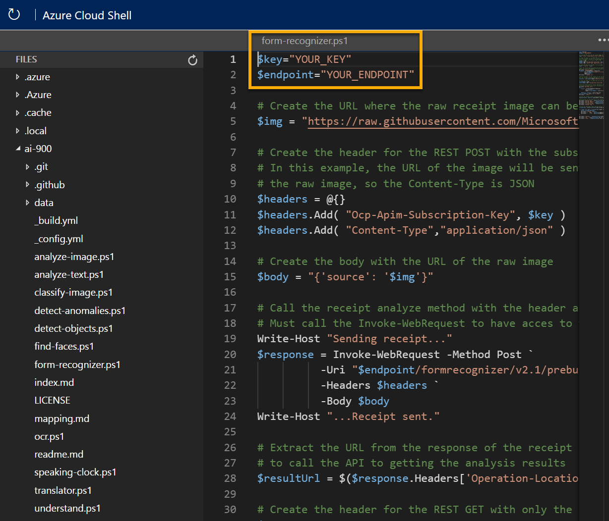

---
lab:
  title: Изучение распознавания документов
---

# <a name="explore-form-recognition"></a>Изучение распознавания документов

> **Примечание**. Для выполнения этого задания вам потребуется [подписка Azure](https://azure.microsoft.com/free?azure-portal=true), в которой у вас есть административный доступ.

В разделе технологий искусственного интеллекта (ИИ), компьютерном зрении, оптическое распознавание символов (OCR) обычно используется для чтения печатных или рукописных документов. Часто текст просто извлекается из документов в формат, который можно использовать для дальнейшей обработки или анализа.

Более сложный сценарий OCR — это извлечение информации из форм, например заказов на покупку или счетов, с семантическим пониманием того, что представляют поля в форме. Служба **Распознаватель документов** специально разработана для такого рода задач искусственного интеллекта.

Распознаватель документов использует модели машинного обучения, которые обучены для извлечения текста из изображений накладных, чеков и многого другого. Другие модели компьютерного зрения могут записывать текст, а Распознаватель документов также захватывает структуру текста, такую как пары "ключ — значение" и сведения в таблицах. Таким образом, вместо того, чтобы вводить записи из формы в базу данных вручную, можно автоматически собирать связи между текстом из исходного файла. 

Чтобы протестировать возможности службы "Распознаватель документов", мы используем простое приложение командной строки, которое выполняется в Cloud Shell. Те же принципы и функциональные возможности реализованы и в реальных решениях, таких как веб-сайты и приложения для телефонов.

## <a name="create-a-cognitive-services-resource"></a>Создание ресурса *Cognitive Services*

Для использования службы "Распознаватель документов" можно создать ресурс **Распознаватель документов** или **Cognitive Services**.

Если вы еще этого не сделали, создайте в своей подписке Azure ресурс **Cognitive Services**.

1. На другой вкладке браузера откройте портал Azure по адресу [https://portal.azure.com](https://portal.azure.com?azure-portal=true) и войдите в него, используя свою учетную запись Майкрософт.

1. Нажмите кнопку **&#65291; Создать ресурс**, выполните поиск по запросу *Cognitive Services* и создайте ресурс **Cognitive Services** со следующими параметрами:
    - **Подписка**: *ваша подписка Azure*.
    - **Группа ресурсов**: *выберите существующую или создайте новую группу ресурсов с уникальным именем*.
    - **Регион**: *выберите любой доступный регион*.
    - **Имя**: *укажите уникальное имя*.
    - **Ценовая категория**: Стандартный S0.
    - **Устанавливая этот флажок, я подтверждаю, что мною прочитаны все приведенные ниже условия и я понимаю их**: флажок установлен.

1. Проверьте и создайте ресурс, а затем дождитесь завершения развертывания. Затем перейдите к развернутому ресурсу.

1. Откройте страницу **Ключи и конечная точка** для своего ресурса Cognitive Services. Для подключения из клиентских приложений потребуются конечная точка и ключи.

## <a name="run-cloud-shell"></a>Запуск Cloud Shell

Чтобы протестировать возможности службы "Распознаватель документов", мы используем простое приложение командной строки, которое выполняется в Cloud Shell в Azure. 

1. На портале Azure нажмите кнопку **[>_]** (*Cloud Shell*) в верхней части страницы справа от поля поиска. В нижней части портала откроется панель Cloud Shell. 

    

1. При первом запуске Cloud Shell вам может быть предложено выбрать тип оболочки, которую вы будете использовать (*Bash* или *PowerShell*). Выберите ссылку **PowerShell**. В противном случае пропустите этот шаг.  

1. Если вам будет предложено создать хранилище для Cloud Shell, укажите свою подписку и нажмите **Создать хранилище**. Затем подождите минуту, пока хранилище не будет создано.

    

1. Убедитесь, что тип оболочки в левом верхнем углу панели Cloud Shell изменился на *PowerShell*. Если там указана оболочка *Bash*, выберите *PowerShell* из раскрывающегося меню.

     

1. Дождитесь запуска PowerShell. На портале Azure должен отобразиться следующий экран:  

     

## <a name="configure-and-run-a-client-application"></a>Настройка и запуск клиентского приложения

Теперь, когда у вас есть пользовательская модель, можно запустить простое клиентское приложение, использующее службу "Распознаватель документов".

1. В командной оболочке введите следующую команду, чтобы скачать пример приложения и сохранить его в папку ai-900.

    ```PowerShell
    git clone https://github.com/MicrosoftLearning/AI-900-AIFundamentals ai-900
    ```

    >**Совет**. Если вы уже использовали эту команду в другом задании для клонирования репозитория *ai-900*, этот шаг можно пропустить.

1. Файлы скачиваются в папку **ai-900**. Теперь нам нужно просмотреть все файлы в хранилище Cloud Shell и поработать с ними. Введите в оболочке следующую команду:

    ```PowerShell
    code .
    ```

    Обратите внимание, что откроется редактор, подобный следующему: 

    

1. На панели **Файлы** слева разверните узел **ai-900** и выберите файл **form-recognizer.ps1**. Этот файл содержит код, использующий службу "Распознаватель документов" для анализа полей в чеке, как показано ниже:

    

1. Не тратьте слишком много времени на то, чтобы понять подробности кода; важно то, что в нем нужно указать URL-адрес конечной точки и один из ключей для ресурса Cognitive Services. Скопируйте их со страницы **Ключи и конечные точки** для своего ресурса с портала Azure и вставьте в редакторе кода, заменив значения заполнителей **YOUR_KEY** и **YOUR_ENDPOINT** соответственно ключом и конечной точкой.

    > **Совет** Вы можете настроить области **Ключи и конечная точка** и **Редактор** на экране с помощью разделительной полосы.

    После того как значения ключа и конечной точки будут вставлены, первые две строки кода должны выглядеть следующим образом:

    ```PowerShell
    $key="1a2b3c4d5e6f7g8h9i0j...."    
    $endpoint="https..."
    ```

1. В правом верхнем углу панели редактора нажмите кнопку **...**, чтобы открыть меню, и выберите **Сохранить**, чтобы сохранить свои изменения. Затем снова откройте меню и выберите пункт **Закрыть редактор**. Теперь, когда вы настроили ключ и конечную точку, вы можете использовать ресурс для анализа полей из чека. В этом случае вы будете использовать встроенную модель Распознавателя документов для анализа чека от вымышленной торговой компании Northwind Trader.

    Пример клиентского приложения будет анализировать следующее изображение:

    

1. В области PowerShell введите следующие команды для запуска кода:

    ```PowerShell
    cd ai-900
    ./form-recognizer.ps1
    ```

1. Проверьте полученные результаты. Посмотрите, что Распознаватель документов способен интерпретировать данные в форме, правильно определяя адрес и номер телефона получателя, а также дату и время транзакции, строки, подытоги, налоги и итоговые суммы.

## <a name="learn-more"></a>Дополнительные сведения

В этом простом приложении демонстрируются лишь некоторые возможности Распознавателя документов службы Компьютерного зрения. Дополнительные сведения о том, что можно сделать с помощью этой службы, см. на [странице Распознавателя документов](https://docs.microsoft.com/azure/applied-ai-services/form-recognizer/overview).
