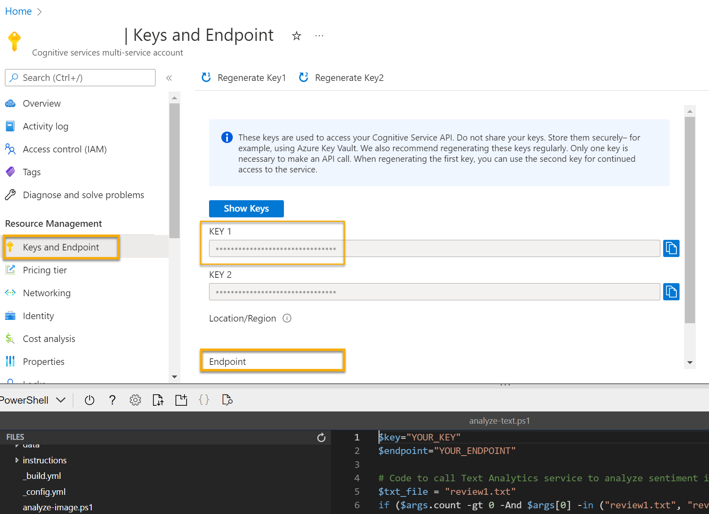

---
lab:
  title: Изучение текстовой аналитики
---

# Изучение текстовой аналитики

> **Примечание**. Для выполнения этого задания вам потребуется [подписка Azure](https://azure.microsoft.com/free?azure-portal=true), в которой у вас есть административный доступ.

Обработка естественного языка (NLP) — это область технологий искусственного интеллекта (ИИ), которая работает с письменными текстами и речью. NLP можно использовать для создания решений, которые извлекают семантическое значение из текста или речи или формируют осмысленные ответы на естественном языке.

*Службы ИИ Microsoft Azure* включают возможности анализа текста в *языковой* службе, которая предоставляет некоторые встроенные возможности NLP, включая идентификацию ключевых фраз в тексте и классификацию текста на основе тональности.

Например, предположим, что вымышленная организация *Margie's Travel* просит клиентов оставлять отзывы о своем пребывании в гостиницах. С помощью языковой службы вы можете обобщать эти отзывы, извлекая из них ключевые фразы, определять, какие из них являются положительными, а какие — отрицательными, а также анализировать текст отзывов на наличие известных сущностей, таких как местоположения или люди.

Чтобы протестировать возможности языковой службы, мы используем простое приложение командной строки, которое выполняется в Cloud Shell. Те же принципы и функциональные возможности реализованы и в реальных решениях, таких как веб-сайты и приложения для телефонов.

## Создание ресурса *служб ИИ Azure*

Вы можете использовать **языковую службу** , создав языковой ресурс или ресурс **служб ИИ Azure** .

Если вы еще этого не сделали, создайте ресурс **служб ИИ Azure** в подписке Azure.

1. На другой вкладке браузера откройте портал Azure по адресу [https://portal.azure.com](https://portal.azure.com?azure-portal=true) и войдите в него, используя свою учетную запись Майкрософт.

1. Нажмите ** кнопку&#65291;Создать ресурс** и найдите *службы ИИ Azure*. Выберите **Создать** план **служб ИИ Azure** . Вы перейдете на страницу для создания ресурса служб ИИ Azure. Настройте его с помощью следующих параметров:
    - **Подписка**: *ваша подписка Azure*.
    - **Группа ресурсов**: *выберите существующую или создайте новую группу ресурсов с уникальным именем*.
    - **Регион**: *выберите любой доступный регион*.
    - **Имя**: *укажите уникальное имя*.
    - **Ценовая категория**: Стандартный S0.
    - **Устанавливая этот флажок, я подтверждаю, что мною прочитаны все приведенные ниже условия и я понимаю их**: флажок установлен.

1. Проверьте и создайте ресурс.

### Получение ключа и конечной точки для ресурса служб ИИ Azure

1. Дождитесь завершения развертывания. Затем перейдите к ресурсу служб ИИ Azure и на странице **Обзор** выберите ссылку, чтобы управлять ключами для службы. Вам потребуются конечная точка и ключи для подключения к ресурсу служб ИИ Azure из клиентских приложений.

1. Откройте страницу **Ключи и конечная точка** для своего ресурса. Для подключения из клиентских приложений вам нужны **ключ** и **конечная точка**.

## Запуск Cloud Shell

Чтобы протестировать возможности языковой службы по анализу текста, мы используем простое приложение командной строки, которое выполняется в Cloud Shell.

1. На портале Azure нажмите кнопку **[>_]** (*Cloud Shell*) в верхней части страницы справа от поля поиска. В нижней части портала откроется панель Cloud Shell.

    

1. При первом запуске Cloud Shell вам может быть предложено выбрать тип оболочки, которую вы будете использовать (*Bash* или *PowerShell*). Выберите ссылку **PowerShell**. В противном случае пропустите этот шаг.  

1. Если вам будет предложено создать хранилище для Cloud Shell, укажите свою подписку и нажмите **Создать хранилище**. Затем подождите минуту, пока хранилище не будет создано.

    

1. Убедитесь, что тип оболочки в левом верхнем углу панели Cloud Shell изменился на *PowerShell*. Если там указана оболочка *Bash*, выберите *PowerShell* из раскрывающегося меню.

    

1. Дождитесь запуска PowerShell. На портале Azure должен отобразиться следующий экран:  

    

## Настройка и запуск клиентского приложения

Теперь, когда у вас есть пользовательская модель, можно запустить простое клиентское приложение, использующее языковую службу.

1. В командной оболочке введите следующую команду, чтобы скачать пример приложения и сохранить его в папку ai-900.

    ```PowerShell
    git clone https://github.com/MicrosoftLearning/AI-900-AIFundamentals ai-900
    ```

    >**Совет**. Если вы уже использовали эту команду в другом задании для клонирования репозитория *ai-900*, этот шаг можно пропустить.

1. Файлы скачиваются в папку **ai-900**. Теперь нам нужно просмотреть все файлы в хранилище Cloud Shell и поработать с ними. Введите в оболочке следующую команду:

     ```PowerShell
    code .
    ```

    Обратите внимание, что откроется редактор, подобный следующему:

    

1. На панели **Файлы** слева разверните узел **ai-900** и выберите файл **analyze-text.ps1**. Этот файл содержит код, использующий языковую службу:

    

1. Не стоит волноваться по поводу содержимого кода. В портал Azure перейдите к ресурсу служб ИИ Azure. Затем выберите страницу **Ключи и конечные точки** на панели слева. Скопируйте ключи и конечную точку со страницы и вставьте в редакторе кода, заменив значения заполнителей **YOUR_KEY** и **YOUR_ENDPOINT** соответственно ключом и конечной точкой.

    > **Совет** Вы можете настроить области **Ключи и конечная точка** и **Редактор** на экране с помощью разделительной полосы.

    

    После того как значения ключа и конечной точки будут заменены, первые строки кода должны выглядеть следующим образом.

    ```PowerShell
    $key="1a2b3c4d5e6f7g8h9i0j...."
    $endpoint="https..."
    ```

1. В правом верхнем углу панели редактора нажмите кнопку **...**, чтобы открыть меню, и выберите **Сохранить**, чтобы сохранить свои изменения. Затем снова откройте меню и выберите пункт **Закрыть редактор**.

    Пример клиентского приложения будет использовать языковую службу Служб ИИ Azure для определения языка, извлечения ключевых фраз, определения тональности и извлечения известных сущностей для проверок.

1. В Cloud Shell введите следующую команду, чтобы выполнить код:

    ```PowerShell
    cd ai-900
    ./analyze-text.ps1 review1.txt
    ```

    Вы будете анализировать следующий текст:

    >Хорошая гостиница и сотрудники, Royal Hotel, Лондон, Великобритания 2 марта 2018 г. Чистые комнаты, хорошее обслуживание, отличное расположение около Букингемского дворца и Вестминстерского аббатства и т. д. Мы очень довольны нашим визитом. Двор очень милый, а еще мы были в индийском ресторане, который является частью той же компании (западное побережье, потому много рыбы), и у него есть звезда Мишлен. Мы заказали дегустационное меню, и это было невероятно. Номера были отличные — с кухней, гостиной, спальней и огромной ванной. Очень рекомендуем.

1. Просмотрите выходные данные.

1. В области PowerShell введите следующую команду, чтобы выполнить код:

    ```PowerShell
    ./analyze-text.ps1 review2.txt
    ```

    Вы будете анализировать следующий текст:

    >Видавший виды отель с плохим обслуживанием Royal Hotel, Лондон, Великобритания, 6 мая 2018 г. Это старая гостиница (примерно 1950-х годов), мебель в номерах так себе — чувствуется возраст, нужно что-то менять. Интернет не работал, и пришлось зайти к ним офис, чтобы зарегистрироваться на обратный рейс. На веб-сайте сказано, что Британский музей рядом, но пешком туда идти далеко.

1. Просмотрите выходные данные.

1. В области PowerShell введите следующую команду, чтобы выполнить код:

    ```PowerShell
    ./analyze-text.ps1 review3.txt
    ```

    Вы будете анализировать следующий текст:

    >Хорошее расположение и готовые помочь сотрудники, но рядом оживленная дорога.
    Lombard Hotel, Сан Франциско, США 16 августа 2018 г. Мы остановились здесь в августе, почитав отзывы. Нам очень рады понравилось расположение — прямо за Честнат-стрит, это роскошная и модная часть города, где много ресторанов. Было приятно прогуляться по приморскому району — очень интересные дома. Обязательно загляните в Музей искусств Сан-Франциско и побродите по прибрежным улочкам, где отличный вид на мост "Золотые ворота" и город. Рядом расположена автобусная остановка, и попасть в центр очень легко. Номера чистые и просторные, а сотрудники дружелюбны и готовы помочь. Единственный недостаток — шум с Ломбард-стрит, поэтому попросите комнату с другой стороны.

1. Просмотрите выходные данные.

1. В области PowerShell введите следующую команду, чтобы выполнить код:

    ```PowerShell
    ./analyze-text.ps1 review4.txt
    ```

    Вы будете анализировать следующий текст:

    >Очень шумно, очень маленькие номера Lombard Hotel, Сан-Франциско, США 5 сентября 2018 г. Отель находится на Ломбард-стрит, очень оживленном ШЕСТИПОЛОСНОМ шоссе, которое ведет прямо с моста "Золотые ворота". Много машин с раннего утра до поздней ночи, особенно на выходных. Шум бы не так мешал, если бы комнаты были лучше изолированы, но шумоизоляции там нет Чтобы заснуть, пришлось использовать затычки для ушей, а на следующий день не хватило сил насладиться городом. Комнаты очень маленькие. Я выбрал номер с двумя двуместными кроватями, но в нем едва хватило для них места. Семье из четырех было очень тесно. При этом номера чистые и недавно обновлены. Гостиница находится в приморском районе, где много заведений общественного питания, а в шаговой доступности — форт. Возможно, отель неплох для молодых людей, которые поздно ложатся спать и стеснены в средствах

1. Просмотрите выходные данные.

## Дополнительные сведения

В этом простом приложении демонстрируются лишь некоторые возможности языковой службы. Дополнительные сведения о том, что можно сделать с помощью этой службы, см. на [странице языковой службы](https://azure.microsoft.com/services/cognitive-services/language-service/).
