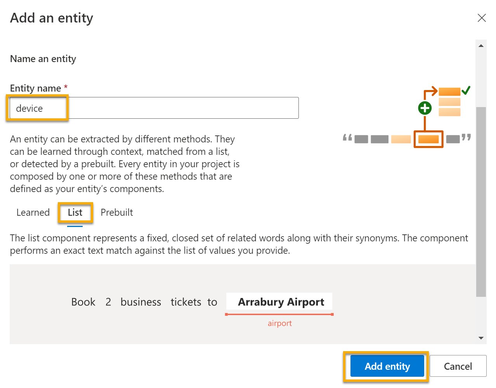

---
lab:
  title: Изучение распознавания речи
---

# Изучение распознавания речи

> **Примечание**. Для выполнения этого задания вам потребуется [подписка Azure](https://azure.microsoft.com/free?azure-portal=true), в которой у вас есть административный доступ.

Мы все чаще ожидаем от компьютеров способности распознавать голосовые или вводимые на естественном языке команды с помощью ИИ. Например, можно развернуть систему автоматизации, которая позволяет управлять домашними устройствами с помощью голосовых команд, таких как "включить свет" или "включить вентилятор", и для этого необходимо устройство на основе искусственного интеллекта, понимающее ваши команды и инициирующее соответствующие действия.

Чтобы протестировать возможности службы "Распознавание устной речи", мы используем приложение командной строки, которое выполняется в Cloud Shell. Те же принципы и функциональные возможности реализованы и в реальных решениях, таких как веб-сайты и приложения для телефонов.

## Создание ресурса *Языковой службы*

Вы можете использовать службу "Распознавание устной речи", создав ресурс **Языковой службы**.

Если вы еще этого не сделали, создайте ресурс **Языковой службы** в своей подписке Azure.

1. На другой вкладке браузера откройте портал Azure по адресу [https://portal.azure.com](https://portal.azure.com?azure-portal=true) и войдите в него, используя свою учетную запись Майкрософт.

1. Нажмите кнопку **&#65291; Создать ресурс**, выполните поиск по запросу *Языковая служба* и создайте ресурс **Языковой службы** со следующими параметрами:
    - Выбор дополнительных функций: *сохраните функции по умолчанию и щелкните "Перейти к созданию ресурса"*.  
    - **Подписка**: *ваша подписка Azure*.
    - **Группа ресурсов**: *выберите существующую или создайте новую группу ресурсов с уникальным именем*.
    - **Регион**: Восточная часть США 2
    - **Имя**: *укажите уникальное имя*.
    - **Ценовая категория**: S (1000 звонков в минуту)
    - **By checking this box I certify that I have reviewed and acknowledge the terms in the Responsible AI Notice** (Устанавливая этот флажок, я подтверждаю, что мною прочтены и приняты условия уведомления об ответственном применении ИИ): установлен.

1. Проверьте и создайте ресурс, а затем дождитесь завершения развертывания.

### Создание приложения Распознавания диалогового языка

Чтобы реализовать распознавание естественной речи с помощью Распознавания диалоговой речи, создайте приложение. Затем добавьте в него сущности, намерения и речевые фрагменты, чтобы задать команды, которые должно выполнять ваше приложение.

1. В новой вкладке браузера откройте портал Language Studio по адресу [https://language.azure.com](https://language.azure.com?azure-portal=true) и войдите в него с учетной записью Майкрософт, связанной с вашей подпиской Azure.

1. При появлении запроса на выбор языкового ресурса выберите следующие параметры:
    - **Каталог Azure**: идентификатор каталога Azure для вашей подписки.
    - **Подписка Azure**: ваша подписка Azure.
    - **Языковой ресурс**: ресурс, созданный ранее.

    >**Совет** Если вам ***не*** предлагается выбрать языковой ресурс, это может быть вызвано тем, что в подписке имеется несколько языковых ресурсов. В этом случае:
    >1. На панели в верхней части страницы нажмите кнопку **Параметры (&#9881;)**.
    >1. На странице **Параметры** перейдите на вкладку **Ресурсы**.
    >1. Выберите свой языковой ресурс и нажмите **Переключить ресурс**.
    >1. В верхней части страницы щелкните **Language Studio**, чтобы вернуться на домашнюю страницу Language Studio.

1. В верхней части портала в меню **Создать** выберите пункт **Распознавание устной речи**.

1. В диалоговом окне **Создание проекта** на странице **Ввод основных сведений** введите следующие сведения и нажмите кнопку **Далее**:
    - **Имя**: *укажите уникальное имя*
    - **Описание**: простая автоматизация домашних устройств
    - **Основной язык речевых фрагментов**: английский.
    - **Включить несколько языков в проекте**: *не выбирайте этот параметр*.

    

    >**Совет** Запишите *имя проекта*, оно понадобится вам позже.

1. На странице *Проверка и завершение* щелкните **Создать**.

### Создание намерений, речевых фрагментов и сущностей

*Намерение* — это действие, которое необходимо выполнить (например, включить свет или выключить вентилятор). В этом случае вы определите два намерения: одно для включения устройства, а другое для его выключения. Для каждого намерения вы укажете пример *речевого фрагмента* — формулировку, используемую для указания намерения.

1. В области **Определение схемы** выберите пункт **Намерения**. Затем щелкните **Добавить**, добавьте намерение с именем **switch_on** (в нижнем регистре) и щелкните **Добавить намерение**.

    
    

1. Выберите намерение **switch_on**. Откроется страница **Маркировка данных**. В раскрывающемся списке **Намерение** выберите **switch_on**. Рядом с намерением **switch_on** введите речевой фрагмент ***turn the light on*** и нажмите клавишу **ВВОД**, чтобы добавить этот речевой фрагмент в список.

    

1. Языковой службе требуется не менее пяти различных примеров речевых фрагментов для каждого намерения, чтобы правильно обучить языковую модель. Добавьте для намерения **switch_on** еще пять примеров речевых фрагментов:  
    - ***включи вентилятор***
    - ***выключи вентилятор***
    - ***put the light on*** (включи свет)
    - ***switch on the light*** (включи освещение)
    - ***включи вентилятор***

1. В области **Метки сущностей для обучения** с правой стороны экрана выберите **Метки**, а затем — **Добавить сущность**. Введите **устройство** (в нижнем регистре), выберите **Список** и нажмите **Добавить сущность**.

     
    

1. В речевом фрагменте ***включи вентилятор*** выделите слово "вентилятор". В открывшемся списке в поле *Поиск сущности* выберите **device**.

    

1. Сделайте то же самое для всех высказываний. Укажите для остальных речевых фрагментов *вентилятор* или *свет* метку сущности **устройство**. По завершении убедитесь в наличии следующих речевых фрагментов и обязательно выберите **Сохранить изменения**:

    | **намерение** | **речевой фрагмент** | **сущность** |
    | --------------- | ------------------ | ------------------ |
    | switch_on   | Включи вентилятор      | Device - *select fan* |
    | switch_on   | Включи свет    | Device - *select light* |
    | switch_on   | Включить свет | Device - *select light* |
    | switch_on   | Включить вентилятор     | Device - *select fan* |
    | switch_on   | Включай вентилятор   | Device - *select fan* |
    | switch_on   | Включи освещение   | Device - *select light* |

     

1. В области слева щелкните **Определение схемы** и убедитесь, что намерение **switch_on** присутствует в списке. Затем нажмите кнопку **Добавить** и добавьте новое намерение с именем **switch_off** (в нижнем регистре).

     

1. Щелкните намерение **switch_off**. Откроется страница **Маркировка данных**. В раскрывающемся списке **Намерение** выберите **switch_off**. Рядом с намерением **switch_off** добавьте речевой фрагмент ***выключи свет***.

1. Добавьте для намерения **switch_off** еще пять примеров речевых фрагментов.
    - ***выключи вентилятор***
    - ***put the fan off*** (выключи вентилятор)
    - ***put the light off*** (выключи освещение)
    - ***turn off the light*** (выключи свет)
    - ***выключить вентилятор***

1. Укажите для слов *свет* или *вентилятор* метку сущности **устройство**. По завершении убедитесь в наличии следующих речевых фрагментов и обязательно выберите **Сохранить изменения**:  

    | **намерение** | **речевой фрагмент** | **сущность** | 
    | --------------- | ------------------ | ------------------ |
    | switch_off   | Выключи вентилятор    | Device - *select fan* | 
    | switch_off   | Выключи освещение  | Device - *select light* |
    | switch_off   | Выключить свет | Device - *select light* |
    | switch_off   | Выключить вентилятор | Device - *select fan* |
    | switch_off   | Выключите вентилятор | Device - *select fan* |
    | switch_off   | Отключить свет | Device - *select light* |

### Обучение модели

Теперь вы готовы к использованию целей и сущностей, заданных для обучения модели интерактивного взаимодействия для приложения.

1. В Language Studio слева выберите **Задания обучения** и нажмите **Начать задание обучения**. Используйте следующие параметры: 
    - **Обучить новую модель**: *выбрано с указанием имени модели*.
    - **Режим обучения**: стандартное обучение (бесплатно)
    - **Разделение данных**: *выберите "Автоматически отделить набор тестирования от обучающих данных", сохраните проценты по умолчанию*
    - Щелкните **Обучить** в нижней части страницы.

1. Дождитесь завершения обучения. 

### Развертывание и тестирование модели

Чтобы использовать обученную модель в клиентском приложении, необходимо развернуть ее в качестве конечной точки, куда клиентские приложения смогут отправлять новые речевые фрагменты, на основе которых будут прогнозироваться намерения и сущности.

1. В левой части Language Studio выберите **Развертывание модели**.

1. Выберите имя своей модели и щелкните **Добавить развертывание**. Используйте следующие параметры.
    - **Создайте или выберите существующее имя развертывания**: *выберите создание имени развертывания. Укажите уникальное имя*.
    - **Назначьте обученную модель имени развертывания**: *выберите имя обученной модели*.
    - Щелкните **Развернуть**.

    >**Совет** Запишите *имя развертывания*, оно понадобится вам позже. 

1. Когда модель будет развернута, щелкните **Тестирование развертывания** с левой стороны страницы, а затем в пункте **Имя развертывания** укажите свою модель.

1. Введите следующий текст и нажмите кнопку **Запустить тест**:

    *switch the light on* (включить свет)

     

    Проверьте возвращаемый результат, отметив, что он включает прогнозируемое намерение (которое должно быть **switch_on**) и прогнозируемую сущность (**device**) с показателями достоверности, указывающими вероятность, которую модель вычисляет для прогнозируемого намерения и сущности. На вкладке JSON показана сравнительная достоверность для каждого потенциального намерения (с наивысшим показателем достоверности соответствующим прогнозируемому намерению).

1. Очистите текстовое поле и проверьте модель, указав следующие речевые фрагменты в поле *Введите текст или загрузите текстовый документ*:
    - *turn off the fan* (выключить вентилятор)
    - *put the light on* (включи свет)
    - *put the fan off* (выключи вентилятор)

## Запустите Cloud Shell

Теперь опробуем развернутую модель. Для этого мы будем использовать приложение командной строки, выполняющееся в Cloud Shell в Azure. 

1. Не закрывая вкладку браузера с Language Studio, вернитесь на вкладку браузера с порталом Azure.

1. На портале Azure нажмите кнопку **[>_]** (*Cloud Shell*) в верхней части страницы справа от поля поиска. После нажатия кнопки в нижней части портала откроется панель Cloud Shell.

    

1. При первом запуске Cloud Shell вам может быть предложено выбрать тип оболочки, которую вы будете использовать (*Bash* или *PowerShell*). Выберите **PowerShell**. В противном случае пропустите этот шаг.  

1. Если вам будет предложено создать хранилище для Cloud Shell, укажите свою подписку и нажмите **Создать хранилище**. Затем подождите минуту, пока хранилище не будет создано. 

    

1. Убедитесь, что тип оболочки в левом верхнем углу панели Cloud Shell изменился на *PowerShell*. Если там указана оболочка *Bash*, выберите *PowerShell* из раскрывающегося меню.

     

1. Дождитесь запуска PowerShell. На портале Azure должен отобразиться следующий экран:  

     

## Настройка и запуск клиентского приложения

Теперь откроем и изменим готовый скрипт, который запустит клиентское приложение.

1. В командной оболочке введите следующую команду, чтобы скачать пример приложения и сохранить его в папку ai-900.

    ```PowerShell
    git clone https://github.com/MicrosoftLearning/AI-900-AIFundamentals ai-900
    ```

    >**Совет** Если вы уже использовали эту команду в другом задании для клонирования репозитория *ai-900*, этот шаг можно пропустить.

1. Файлы скачиваются в папку **ai-900**. Теперь нужно просмотреть все файлы в этой папке и поработать с ними. Введите в оболочке следующую команду:

     ```PowerShell
    cd ai-900
    code .
    ```

    Обратите внимание, что откроется редактор, подобный следующему: 

    

1. В области **Файлы** слева выберите файл **understand.ps1** в папке **ai-900**. Этот файл содержит некоторый код, который использует модель Распознавания диалогового языка. 

    

    Не стоит волноваться по поводу содержимого кода. Выполните инструкции, чтобы изменить файл, указав обученную языковую модель. 

1. Вернитесь на вкладку браузера с **Language Studio**. Затем в Language Studio откройте страницу **Развертывание модели** и выберите модель. Затем нажмите кнопку **Получить URL-адрес прогноза**. В этом диалоговом окне представлены два фрагмента информации, которые необходимы.
    - Конечная точка для вашей модели — вы можете скопировать конечную точку из поля **URL-адрес прогноза**.
    - Ключ для вашей модели — ключ находится в разделе **Пример запроса** в качестве значения параметра **Ocp-Apim-Subscription-Key** и выглядит аналогично следующему: ***0ab1c23de4f56gh7i8901234jkl567m8***.

1. Скопируйте значение конечной точки, а затем вернитесь на вкладку браузера с Cloud Shell и вставьте его в редактор кода, заменив **YOUR_ENDPOINT** (в кавычках). Повторите этот процесс для ключа, заменив **YOUR_KEY**.

1. Затем замените **YOUR_PROJECT_NAME** именем проекта, а **YOUR_DEPLOYMENT_NAME** — именем развернутой модели. Первые строки кода должны выглядеть следующим образом:

    ```PowerShell
    $endpointUrl="https://some-name.cognitiveservices.azure.com/language/..."
    $key = "0ab1c23de4f56gh7i8901234jkl567m8"
    $projectName = "name"
    $deploymentName = "name"
    ```

1. В правом верхнем углу панели редактора нажмите кнопку **...**, чтобы открыть меню, и выберите **Сохранить**, чтобы сохранить свои изменения. Затем снова откройте меню и выберите пункт **Закрыть редактор**.

1. В области PowerShell введите следующую команду, чтобы выполнить код:

    ```PowerShell
    ./understand.ps1 "Turn on the light"
    ```

1. Проверка результатов. Приложение должно понять, что требуемое действие — включить свет.

1. Теперь попробуйте другую команду:

    ```PowerShell
    ./understand.ps1 "Switch the fan off"
    ```

1. Проверьте результаты этой команды. Приложение должно понять, что требуемое действие — выключить вентилятор.

1. Поэкспериментируйте с другими командами, включая те, которым модель не была обучена, например "Hello" (Примет) или "switch on the oven" (включить микроволновку). Приложение должно понимать команды, для которых языковая модель определена, и корректно завершать работу для других входных данных.

>**Примечание** Каждый раз вам нужно будет сначала указывать **./understand.ps1**, а затем вводить фразу. Заключите фразу в кавычки.

## Подробнее

Это приложение реализует лишь некоторые возможности функции "Распознавание устной речи" языковой службы. Дополнительные сведения о том, что можно сделать с помощью этой службы, см. на [этой странице](https://docs.microsoft.com/azure/cognitive-services/language-service/conversational-language-understanding/overview). 
